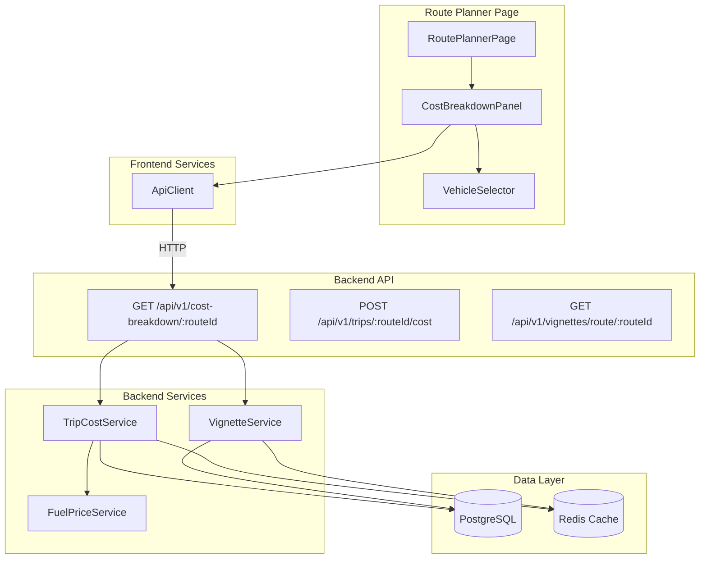
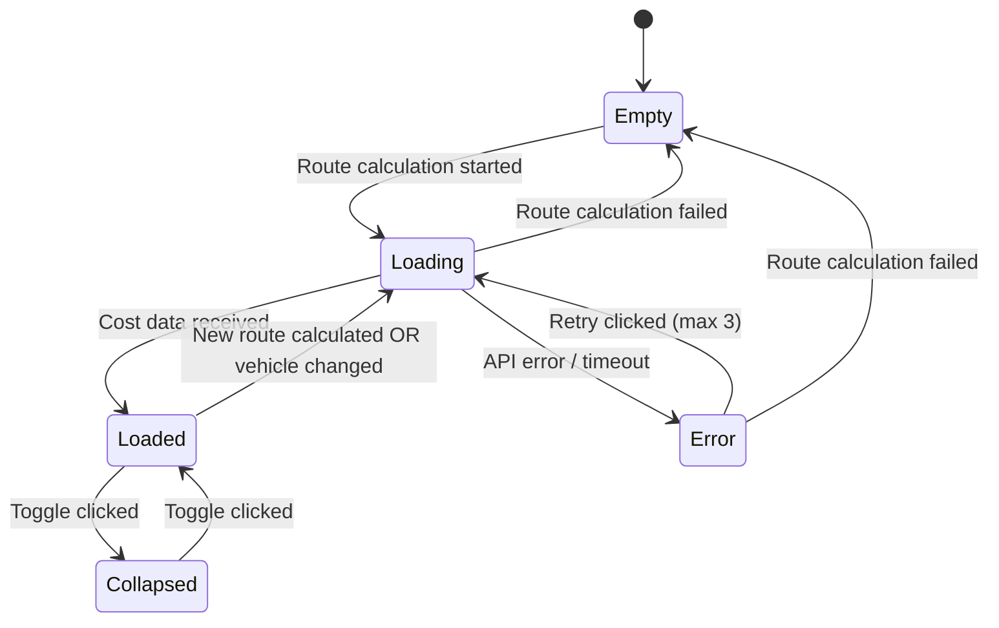
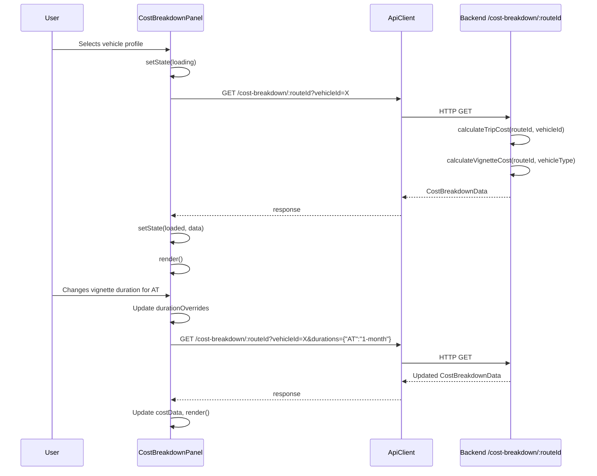

# Design Document: Cost Breakdown Panel

## Overview

The Cost Breakdown Panel is a new frontend component integrated into the Route Planner page that consolidates fuel costs, vignette costs, and a total trip cost into a single, always-visible panel. It replaces the need to navigate to separate Trip Cost and Vignette Cost pages by surfacing cost data directly in the route planning workflow.

The panel reuses existing backend APIs (`POST /api/v1/trips/:routeId/cost` and `GET /api/v1/vignettes/route/:routeId`) and introduces a new composite endpoint that returns both fuel and vignette breakdowns in a single response. The frontend component manages its own state machine (empty → loading → loaded → error) and integrates with the existing `RoutePlannerPage` class.

**Key design decisions:**
- No new database tables — all data is derived from existing route segments, fuel prices, and vignette prices
- A single composite API endpoint reduces frontend round-trips from 2 to 1
- The panel is a standalone class (`CostBreakdownPanel`) composed into `RoutePlannerPage`, following the existing page-class pattern
- Pure computation functions are extracted for testability (fuel cost calculation, vignette cost aggregation, currency formatting)

## Architecture



### State Machine



## Components and Interfaces

### Frontend Components

#### CostBreakdownPanel

The main panel component, instantiated by `RoutePlannerPage` and rendered into a dedicated container element.

```typescript
// frontend/src/components/CostBreakdownPanel.ts

type PanelState = 'empty' | 'loading' | 'loaded' | 'error';

interface CostBreakdownPanelOptions {
  container: HTMLElement;
  onVehicleChange?: (vehicleId: string) => void;
}

class CostBreakdownPanel {
  private state: PanelState = 'empty';
  private collapsed: boolean = false;
  private costData: CostBreakdownData | null = null;
  private selectedVehicleId: string | null = null;
  private errorMessage: string | null = null;
  private retryCount: number = 0;
  private routeId: string | null = null;

  constructor(options: CostBreakdownPanelOptions);
  render(): void;
  setRouteCalculating(): void;
  setRouteResult(routeId: string): void;
  setRouteFailed(): void;
  setVehicleProfiles(profiles: VehicleProfileResponse[]): void;
  destroy(): void;
}
```

#### VehicleSelector

A sub-component for the vehicle profile dropdown.

```typescript
// frontend/src/components/VehicleSelector.ts

interface VehicleSelectorOptions {
  container: HTMLElement;
  onSelect: (vehicleId: string) => void;
}

class VehicleSelector {
  private profiles: VehicleProfileResponse[] = [];
  private selectedId: string | null = null;

  constructor(options: VehicleSelectorOptions);
  render(): void;
  setProfiles(profiles: VehicleProfileResponse[]): void;
  getSelectedId(): string | null;
}
```

### Pure Computation Module

Extracted for testability and reuse:

```typescript
// frontend/src/services/costCalculations.ts

export interface RouteSegmentCost {
  countryCode: string;
  countryName: string;
  distanceKm: number;
  fuelCostEur: number;
}

export interface VignetteSelection {
  countryCode: string;
  countryName: string;
  duration: VignetteDuration;
  priceEur: number;
  exempt: boolean;
  unavailable: boolean;
}

/**
 * Calculate fuel cost for a single segment.
 * Formula: (distance_km / 100) × consumption_per_100km × price_per_liter
 */
export function calculateSegmentFuelCost(
  distanceKm: number,
  consumptionPer100km: number,
  pricePerLiter: number
): number;

/**
 * Calculate total fuel cost from segments, filtering out sub-1km segments.
 */
export function calculateTotalFuelCost(
  segments: Array<{ distanceKm: number; countryCode: string }>,
  consumptionPer100km: number,
  fuelPrices: Record<string, number>
): { total: number; breakdown: RouteSegmentCost[] };

/**
 * Select the shortest available vignette duration for a country.
 */
export function selectDefaultDuration(
  availableDurations: VignetteDuration[]
): VignetteDuration;

/**
 * Calculate total vignette cost from selections.
 */
export function calculateTotalVignetteCost(
  selections: VignetteSelection[]
): number;

/**
 * Format a number as EUR currency string: €X.XX
 */
export function formatEur(amount: number): string;

/**
 * Calculate total trip cost from fuel and vignette components.
 */
export function calculateTripTotal(
  fuelCost: number | null,
  vignetteCost: number | null
): { total: number; isPartial: boolean };
```

### Backend API

#### New Composite Endpoint

```typescript
// GET /api/v1/cost-breakdown/:routeId?vehicleId={id}&durations={json}
// Combines fuel cost + vignette cost in a single response

interface CostBreakdownResponse {
  status: 200;
  data: CostBreakdownData;
  requestId: string;
}

interface CostBreakdownData {
  totalCostEur: number;
  isPartialEstimate: boolean;
  fuel: {
    totalFuelCostEur: number;
    breakdown: FuelCountryBreakdown[];
  };
  vignettes: {
    totalVignetteCostEur: number;
    breakdown: VignetteCountryBreakdown[];
  };
  vehicleProfile: {
    id: string;
    name: string;
    fuelType: FuelType;
    consumptionPer100km: number;
  };
}

interface FuelCountryBreakdown {
  countryCode: string;
  countryName: string;
  distanceKm: number;
  fuelPricePerLiter: number;
  fuelCostEur: number;
}

interface VignetteCountryBreakdown {
  countryCode: string;
  countryName: string;
  required: boolean;
  motorcycleExempt: boolean;
  selectedDuration: VignetteDuration;
  availableDurations: VignetteDuration[];
  priceEur: number;
  priceUnavailable: boolean;
}
```

## Data Models

No new database tables are required. The feature composes existing data:

### Existing Models Used

| Model | Table | Usage |
|-------|-------|-------|
| `RouteSegment` | `route_segments` | Country codes and distances per segment |
| `VehicleProfile` | `vehicle_profiles` | Fuel type, consumption rate |
| `VignetteCountry` | `vignette_countries` | Which countries need vignettes, exemptions |
| `VignettePrice` | `vignette_prices` | Price per duration/vehicle type |
| Fuel prices | `fuel_prices` (cached in Redis) | Price per liter per country/fuel type |

### Frontend State Model

```typescript
interface CostBreakdownState {
  panelState: 'empty' | 'loading' | 'loaded' | 'error';
  collapsed: boolean;
  routeId: string | null;
  selectedVehicleId: string | null;
  vehicleProfiles: VehicleProfileResponse[];
  costData: CostBreakdownData | null;
  errorMessage: string | null;
  retryCount: number;
  durationOverrides: Record<string, VignetteDuration>;
}
```

### API Request/Response Flow



## Correctness Properties

*A property is a characteristic or behavior that should hold true across all valid executions of a system — essentially, a formal statement about what the system should do. Properties serve as the bridge between human-readable specifications and machine-verifiable correctness guarantees.*

### Property 1: Fuel cost formula correctness

*For any* route segment with distance ≥ 1 km, any vehicle consumption rate in [1, 50] L/100km, and any fuel price > 0, the computed fuel cost for that segment SHALL equal `(distanceKm / 100) × consumptionPer100km × pricePerLiter`, rounded to 2 decimal places, and the total fuel cost SHALL equal the sum of all per-segment costs rounded to 2 decimal places.

**Validates: Requirements 3.1, 3.3**

### Property 2: Traversal order preservation

*For any* sequence of route segments ordered by segment_index, the per-country fuel breakdown output SHALL list countries in the same order as they appear in the segment sequence (first occurrence order).

**Validates: Requirements 3.2**

### Property 3: Sub-1km segment filtering

*For any* set of route segments, segments with distance < 1 km SHALL NOT appear in the fuel cost breakdown, and their cost SHALL NOT be included in the total fuel cost.

**Validates: Requirements 3.4**

### Property 4: Vignette total equals sum of selected durations

*For any* set of vignette country selections with known prices, the total vignette cost SHALL equal the sum of the price for each country's selected duration, excluding exempt and unavailable countries, rounded to 2 decimal places.

**Validates: Requirements 4.1, 4.4**

### Property 5: Vignette entry completeness

*For any* country on the route that requires a vignette, the vignette breakdown entry SHALL contain the country name, the selected duration, and the price in EUR (or an unavailable indicator).

**Validates: Requirements 4.2**

### Property 6: Default duration is shortest available

*For any* country with a non-empty set of available vignette durations, the default selected duration SHALL be the one with the lowest value in the DURATION_ORDER mapping.

**Validates: Requirements 4.3**

### Property 7: Motorcycle exemption zeroes cost

*For any* country where `motorcycle_exempt` is true, when the vehicle type is `motorcycle`, the vignette cost for that country SHALL be 0 and the country SHALL be marked as exempt.

**Validates: Requirements 4.5**

### Property 8: Total trip cost is sum of components

*For any* fuel cost F ≥ 0 and vignette cost V ≥ 0, the total trip cost SHALL equal F + V, rounded to 2 decimal places.

**Validates: Requirements 5.1**

### Property 9: Currency formatting

*For any* non-negative number, the formatted EUR string SHALL match the pattern `€X.XX` where X.XX is the number rounded to exactly 2 decimal places.

**Validates: Requirements 5.3**

## Error Handling

### Error Categories and Responses

| Error Type | Source | Panel Behavior | User Action |
|-----------|--------|----------------|-------------|
| Network timeout (15s) | Fetch API | Show connectivity error, retain previous data | Retry button (max 3) |
| API 401 Unauthorized | Backend | Show "login required" message | Redirect to login |
| API 404 Route not found | Backend | Show error, clear panel | Recalculate route |
| API 500 Server error | Backend | Show generic error with retry | Retry button (max 3) |
| Partial fuel price data | Backend response | Show partial total with warning | None (informational) |
| Partial vignette data | Backend response | Show "unavailable" per country, partial total | None (informational) |
| No vehicle profiles | Frontend state | Show "create vehicle" prompt | Link to vehicle form |

### Retry Strategy

```typescript
const MAX_RETRIES = 3;
const TIMEOUT_MS = 15_000;

async function fetchCostBreakdown(
  routeId: string,
  vehicleId: string,
  durations?: Record<string, string>,
  retryCount: number = 0
): Promise<CostBreakdownData> {
  const controller = new AbortController();
  const timeoutId = setTimeout(() => controller.abort(), TIMEOUT_MS);

  try {
    const response = await apiClient.get<CostBreakdownData>(
      `/cost-breakdown/${routeId}`,
      { vehicleId, durations: durations ? JSON.stringify(durations) : undefined }
    );
    return response.data;
  } catch (error) {
    if (retryCount >= MAX_RETRIES) throw error;
    throw error; // Let panel handle retry via button
  } finally {
    clearTimeout(timeoutId);
  }
}
```

### Partial Data Handling

The backend endpoint returns `isPartialEstimate: true` when any country's fuel price or vignette price is unavailable. The frontend displays:
- Individual countries with missing data get an "unavailable" badge
- The total is labeled "Partial estimate" with a tooltip explaining which data is missing
- Available cost components are still summed and displayed

## Testing Strategy

### Property-Based Tests (fast-check)

The project already uses `fast-check` (v3.23.2) and `vitest` (v3.1.3). Property tests target the pure computation module (`costCalculations.ts`):

- **Library**: fast-check
- **Runner**: vitest
- **Minimum iterations**: 100 per property
- **Location**: `src/services/costCalculations.test.ts` (backend) and `frontend/src/services/costCalculations.test.ts`

Each property test is tagged with:
```typescript
// Feature: cost-breakdown-panel, Property N: <property text>
```

Properties 1–9 from the Correctness Properties section are implemented as individual `fc.assert(fc.property(...))` calls.

### Unit Tests (example-based)

| Component | Test Focus |
|-----------|-----------|
| `CostBreakdownPanel` | State transitions (empty→loading→loaded→error), render output per state |
| `VehicleSelector` | Profile list rendering, selection callback, empty state |
| `formatEur` | Specific examples: 0, 12.345→€12.35, 1000.1→€1000.10 |
| Backend endpoint | Auth guard, route ownership, missing vehicle, partial data response |

### Integration Tests

| Scenario | Approach |
|----------|----------|
| Full cost calculation flow | Supertest against Express app with seeded DB |
| Vignette duration change | API call with duration overrides, verify recalculated total |
| Motorcycle exemption | API call with motorcycle vehicle, verify exempt countries excluded |

### Edge Case Tests

- Route with 0 vignette countries → "no vignettes required" message
- All fuel prices unavailable → partial estimate with fuel = unavailable
- Network timeout simulation → error state with retry button
- 4th retry attempt → retry button disabled
- Viewport resize across 1024px breakpoint → layout transition
