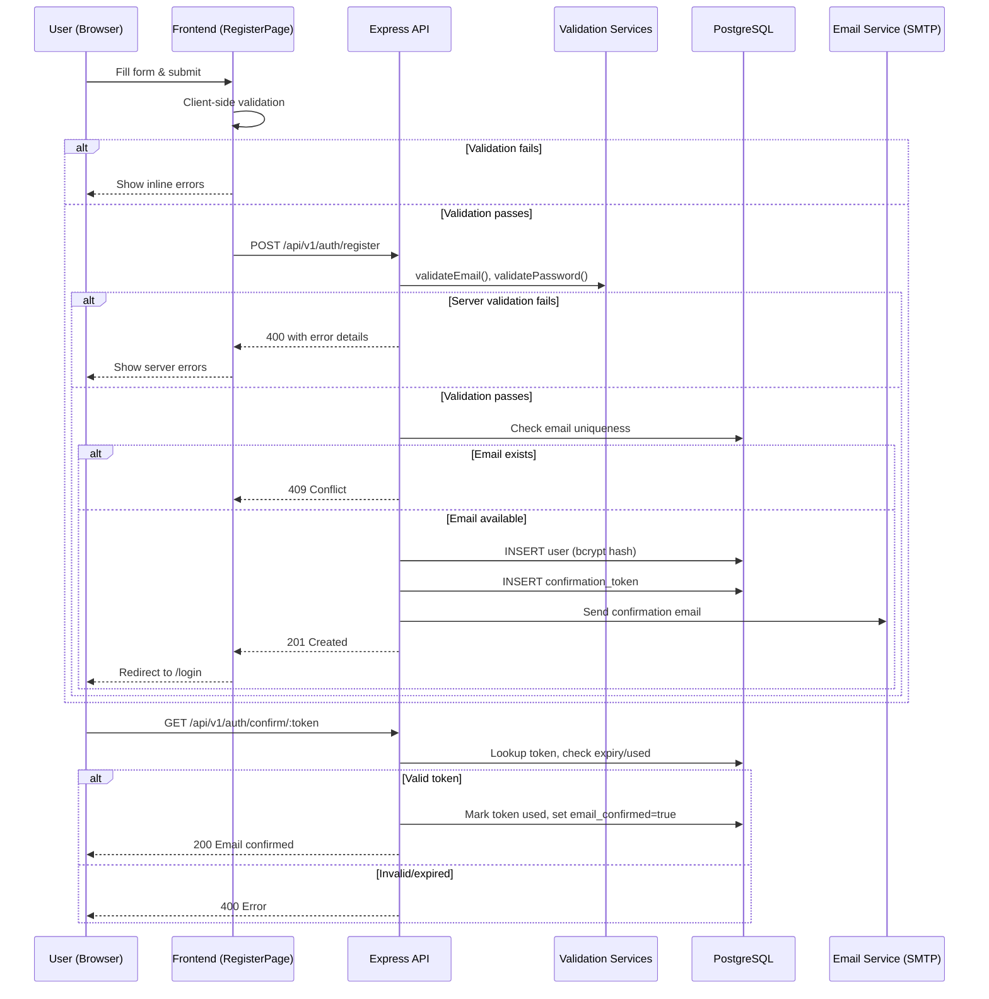
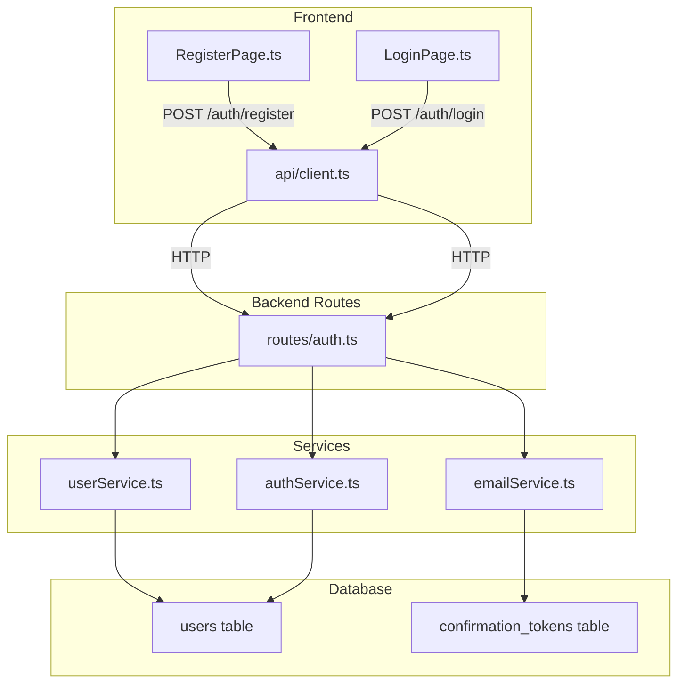

# Design Document: Email Registration

## Overview

This design describes the email/password registration flow for the Route Planner application. The feature allows users to create accounts with an email address and password (as an alternative to Google/Apple SSO), validates input on both client and server, sends a confirmation email with a time-limited token, and enforces account lockout after repeated failed login attempts.

The implementation builds on the existing Express/TypeScript backend, PostgreSQL database (with the `users` and `confirmation_tokens` tables already migrated), and the vanilla TypeScript frontend served via Vite.

### Key Design Decisions

1. **Validation on both layers** — Client-side validation provides instant feedback; server-side validation is the authoritative gate. Both use the same rules.
2. **Bcrypt cost factor 12** — Already implemented in `userService.ts`. Balances security with acceptable latency (~250ms on modern hardware).
3. **24-hour confirmation tokens** — Stored in `confirmation_tokens` table with `used` flag and `expires_at`. Tokens are 64-character hex strings (32 random bytes).
4. **Sliding-window lockout** — 5 failed attempts within any 60-minute window triggers a 30-minute lock. The existing `authService.ts` already tracks `failed_login_attempts` and `locked_until`.
5. **Rate limiting on resend** — Max 5 resend requests per hour per user, enforced server-side.
6. **Email normalization** — Lowercase + trim before storage and comparison.

## Architecture



### Component Interaction



## Components and Interfaces

### Backend Components

#### 1. Password Validator (`src/services/userService.ts` — `validatePassword`)

Already implemented. Validates:
- Minimum 8 characters
- At least one uppercase letter (`/[A-Z]/`)
- At least one lowercase letter (`/[a-z]/`)
- At least one digit (`/[0-9]/`)

**Addition needed**: Maximum 128 characters check.

```typescript
export function validatePassword(password: string): ValidationResult {
  const errors: string[] = [];
  if (password.length < 8) errors.push('Password must be at least 8 characters');
  if (password.length > 128) errors.push('Password must not exceed 128 characters');
  if (!/[A-Z]/.test(password)) errors.push('Password must contain at least one uppercase letter');
  if (!/[a-z]/.test(password)) errors.push('Password must contain at least one lowercase letter');
  if (!/[0-9]/.test(password)) errors.push('Password must contain at least one digit');
  return { valid: errors.length === 0, errors };
}
```

#### 2. Email Validator (`src/services/userService.ts` — `validateEmail`)

Already implemented. Validates format with regex `/^[^\s@]+@[^\s@]+\.[^\s@]+$/`.

**Addition needed**: Max 254 character length check.

```typescript
export function validateEmail(email: string): ValidationResult {
  const errors: string[] = [];
  if (!email || email.trim().length === 0) {
    errors.push('Email is required');
    return { valid: false, errors };
  }
  if (email.length > 254) {
    errors.push('Email must not exceed 254 characters');
  }
  const emailRegex = /^[^\s@]+@[^\s@]+\.[^\s@]+$/;
  if (!emailRegex.test(email.trim())) {
    errors.push('Email format is invalid');
  }
  return { valid: errors.length === 0, errors };
}
```

#### 3. Display Name Validator (new — `src/services/userService.ts`)

```typescript
export function validateDisplayName(displayName: string): ValidationResult {
  const errors: string[] = [];
  if (!displayName || displayName.trim().length === 0) {
    errors.push('Display name is required');
  } else if (displayName.trim().length > 100) {
    errors.push('Display name must not exceed 100 characters');
  }
  return { valid: errors.length === 0, errors };
}
```

#### 4. Registration Route (`src/routes/auth.ts` — `POST /register`)

Already implemented. Calls `createUser`, then `generateConfirmationToken` + `sendConfirmationEmail`. Returns 201 on success, 400 on validation errors, 409 on duplicate email.

**Addition needed**: Validate display name length, aggregate all validation errors into a single response.

#### 5. Confirmation Route (`src/routes/auth.ts` — `GET /confirm/:token`)

Already implemented. Looks up token, checks `used` and `expires_at`, marks confirmed.

**Addition needed**: Differentiate error messages (malformed vs expired vs already used).

#### 6. Resend Confirmation Route (new — `POST /api/v1/auth/resend-confirmation`)

```typescript
interface ResendRequest {
  email: string;
}
// Response: 200 on success, 429 if rate limited, 404 if email not found
```

Rate limit: max 5 requests per hour per user. Track via a counter in the `confirmation_tokens` table (count tokens created in last hour for user).

#### 7. Login Enhancement (`src/services/authService.ts`)

Already implemented:
- Checks `email_confirmed === false` → 403
- Checks `locked_until` → 423
- Tracks `failed_login_attempts`, locks after 5 failures

**Addition needed**: Sliding window check — only count failures within the last 60 minutes. Currently the counter never resets by time alone (only on successful login or lockout expiry). Add a `last_failed_at` column or use timestamp-based logic.

### Frontend Components

#### 8. RegisterPage (`frontend/src/pages/RegisterPage.ts`)

Already implemented with client-side validation for password rules.

**Additions needed**:
- Email format validation before submit
- Display name max length (100) and email max length (254) via `maxlength` attributes
- Show all password errors at once (currently shows one at a time)
- Disable submit button + show spinner during request

#### 9. LoginPage (`frontend/src/pages/LoginPage.ts`)

Already has a "Register" link. No changes needed for navigation requirement.

### API Endpoints Summary

| Method | Path | Auth | Description |
|--------|------|------|-------------|
| POST | `/api/v1/auth/register` | Public | Create account |
| POST | `/api/v1/auth/login` | Public | Authenticate |
| GET | `/api/v1/auth/confirm/:token` | Public | Confirm email |
| POST | `/api/v1/auth/resend-confirmation` | Public | Resend confirmation email |

## Data Models

### Users Table (existing)

```sql
CREATE TABLE users (
  id              UUID PRIMARY KEY DEFAULT gen_random_uuid(),
  email           VARCHAR(255) NOT NULL UNIQUE,
  password_hash   VARCHAR(255),          -- NULL for SSO-only users
  display_name    VARCHAR(100) NOT NULL,
  failed_login_attempts INTEGER DEFAULT 0,
  locked_until    TIMESTAMP,
  email_confirmed BOOLEAN NOT NULL DEFAULT false,
  created_at      TIMESTAMP DEFAULT NOW(),
  updated_at      TIMESTAMP DEFAULT NOW()
);
```

### Confirmation Tokens Table (existing)

```sql
CREATE TABLE confirmation_tokens (
  id         UUID PRIMARY KEY DEFAULT gen_random_uuid(),
  user_id    UUID NOT NULL REFERENCES users(id) ON DELETE CASCADE,
  token      VARCHAR(255) NOT NULL UNIQUE,
  expires_at TIMESTAMP NOT NULL,
  used       BOOLEAN DEFAULT false,
  created_at TIMESTAMP DEFAULT NOW()
);
```

### TypeScript Interfaces

```typescript
// Existing — src/models/user.ts
interface User {
  id: string;
  email: string;
  password_hash: string | null;
  display_name: string;
  failed_login_attempts: number;
  locked_until: Date | null;
  email_confirmed: boolean;
  created_at: Date;
  updated_at: Date;
}

interface ValidationResult {
  valid: boolean;
  errors: string[];
}

// New — for confirmation token operations
interface ConfirmationToken {
  id: string;
  user_id: string;
  token: string;
  expires_at: Date;
  used: boolean;
  created_at: Date;
}
```


## Correctness Properties

*A property is a characteristic or behavior that should hold true across all valid executions of a system — essentially, a formal statement about what the system should do. Properties serve as the bridge between human-readable specifications and machine-verifiable correctness guarantees.*

### Property 1: Password validation rejects all invalid passwords

*For any* string that violates at least one password rule (shorter than 8 characters, longer than 128 characters, missing an uppercase letter, missing a lowercase letter, or missing a digit), `validatePassword` SHALL return `valid: false` with an errors array containing exactly one error message per violated rule.

**Validates: Requirements 2.1, 2.2, 2.3, 2.4, 2.5, 2.6**

### Property 2: Password validation accepts all valid passwords

*For any* string that is between 8 and 128 characters (inclusive) and contains at least one uppercase letter, at least one lowercase letter, and at least one digit, `validatePassword` SHALL return `valid: true` with an empty errors array.

**Validates: Requirements 2.7**

### Property 3: Email validation rejects all invalid emails

*For any* string that does not match the pattern `local@domain.tld` (i.e., fails the regex `/^[^\s@]+@[^\s@]+\.[^\s@]+$/`) or exceeds 254 characters in total length, `validateEmail` SHALL return `valid: false` with a non-empty errors array.

**Validates: Requirements 3.1, 3.4**

### Property 4: Email normalization is idempotent

*For any* valid email string (possibly with mixed case and leading/trailing whitespace), normalizing it (lowercase + trim) and then normalizing again SHALL produce the same result. Additionally, the normalized form SHALL equal `email.toLowerCase().trim()`.

**Validates: Requirements 3.3**

### Property 5: Duplicate email detection is case-insensitive

*For any* registered email address and any case variation of that same address (e.g., "User@Example.COM" vs "user@example.com"), attempting to register with the case variation SHALL be rejected as a duplicate.

**Validates: Requirements 1.4**

### Property 6: Unconfirmed users cannot login

*For any* user whose `email_confirmed` field is `false`, the login function SHALL reject the attempt with a 403 status code, regardless of whether the provided password is correct.

**Validates: Requirements 4.5**

### Property 7: Locked accounts cannot login

*For any* user whose `locked_until` timestamp is in the future, the login function SHALL reject the attempt with a 423 status code, regardless of whether the provided password is correct.

**Validates: Requirements 6.2**

### Property 8: Confirmation tokens are unique

*For any* sequence of N token generation calls (for the same or different users), all N resulting token strings SHALL be distinct.

**Validates: Requirements 4.1**

### Property 9: Resend invalidates previous tokens

*For any* user with an existing unused confirmation token, requesting a resend SHALL cause the previous token to become invalid (marked as used or deleted), and the new token SHALL be valid for confirmation.

**Validates: Requirements 4.6**

## Error Handling

### Backend Error Responses

All error responses follow a consistent JSON structure:

```json
{
  "status": <HTTP status code>,
  "message": "<human-readable summary>",
  "errors": ["<specific error 1>", "<specific error 2>"],
  "requestId": "<request correlation ID>"
}
```

| Scenario | Status | Message |
|----------|--------|---------|
| Missing required fields | 400 | "Missing required fields: email, password" |
| Invalid email format | 400 | "Email format is invalid" |
| Password too short | 400 | "Password must be at least 8 characters" |
| Password too long | 400 | "Password must not exceed 128 characters" |
| Email already registered | 409 | "Email already registered" |
| Email not confirmed | 403 | "Please confirm your email address before logging in." |
| Account locked | 423 | "Account is temporarily locked. Please try again later." |
| Invalid credentials | 401 | "Invalid email or password" |
| Token expired | 400 | "Confirmation token has expired" |
| Token already used | 400 | "Confirmation token has already been used" |
| Token malformed/not found | 400 | "Invalid confirmation token" |
| Resend rate limited | 429 | "Too many resend requests. Please try again later." |

### Frontend Error Handling

- **Network errors**: Display "Unable to connect. Please check your internet connection."
- **Server validation errors (400)**: Display the `errors` array as a list, or the `message` field if no array.
- **Conflict (409)**: Display "This email is already registered. Try logging in instead."
- **Rate limit (429)**: Display the server message.
- **Unexpected errors (5xx)**: Display "Something went wrong. Please try again later."

### Graceful Degradation

- If SMTP is unavailable during registration, the account is still created. The user can request a resend later.
- If the confirmation link is clicked after token expiry, the user is shown a clear message with a "Resend" option.

## Testing Strategy

### Property-Based Tests (using `fast-check`)

The project already includes `fast-check` (v3.23.2) as a dev dependency. Property tests will be configured with a minimum of 100 iterations each.

**Target functions for PBT:**
- `validatePassword` — Properties 1 and 2
- `validateEmail` — Property 3
- Email normalization logic — Property 4
- `generateConfirmationToken` uniqueness — Property 8

Each property test will be tagged with a comment:
```typescript
// Feature: email-registration, Property 1: Password validation rejects all invalid passwords
```

### Unit Tests (using `vitest`)

Example-based tests for:
- Missing field combinations (Req 1.2)
- Bcrypt cost factor verification (Req 1.5)
- Specific token error cases: malformed, expired, already used (Req 4.3)
- Email send failure doesn't break registration (Req 4.4)
- Successful login resets failed attempt counter (Req 6.3)
- Form structure: fields present, maxlength attributes (Req 5.1, 5.7)
- Navigation links present with correct attributes (Req 7.1, 7.2)

### Integration Tests (using `vitest` + `supertest`)

- Full registration → confirmation → login flow
- Account lockout after 5 failed attempts within 60 minutes (Req 6.1)
- Lockout expiry allows login again (Req 6.4)
- Resend rate limiting (5 per hour) (Req 4.6)
- Duplicate email registration returns 409

### Test File Organization

```
src/services/userService.test.ts        — validatePassword, validateEmail, validateDisplayName PBT + unit
src/services/authService.test.ts        — login rejection properties (mocked DB)
src/services/emailService.test.ts       — token generation uniqueness PBT
src/routes/auth.test.ts                 — integration tests via supertest
frontend/src/pages/RegisterPage.test.ts — form validation, UI behavior
```
