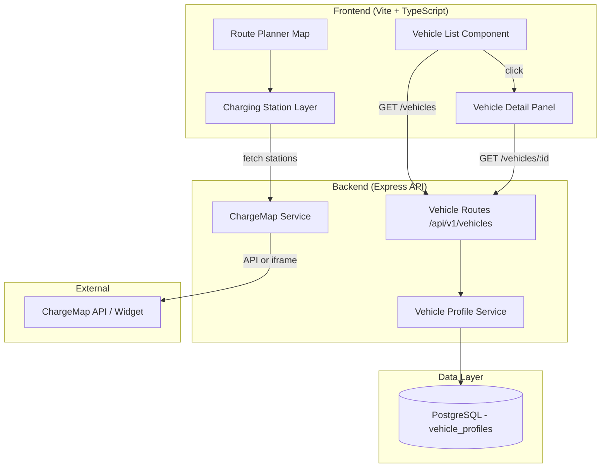

# Design Document: EV Vehicle Category

## Overview

This design extends the Route Planner Platform to support Electric Vehicles (EV) as a first-class vehicle category. The feature touches four layers of the system:

1. **Database** — New migration adding EV-specific columns and updating constraints on `vehicle_profiles`
2. **Backend API & Service** — Extended validation, type definitions, and query logic in the vehicle profile service
3. **Frontend UI** — Replacement of the dropdown-based `VehicleSelector` with a flat list/grid component, plus a new vehicle detail panel
4. **Map Integration** — Charging station overlay on the route planner map for EV vehicles via ChargeMap

The design preserves full backward compatibility for existing ICE vehicle profiles and workflows.

## Architecture



**Key design decisions:**

1. **Single table with nullable columns** — EV fields are added as nullable columns to the existing `vehicle_profiles` table rather than creating a separate table. This keeps queries simple and avoids JOINs for the common list operation. Conditional validation enforces that EV-specific fields are present for EV vehicles and ICE-specific fields for ICE vehicles.

2. **ChargeMap dual-mode integration** — The charging station layer attempts the ChargeMap public API first (filtered by route corridor bounding box). If the API is unavailable or returns an error, it falls back to embedding the ChargeMap iframe widget. This provides a graceful degradation path.

3. **Vehicle List replaces dropdown** — The existing `VehicleSelector` dropdown is replaced entirely by a `VehicleListComponent` that renders a card-based grid. The `CostBreakdownPanel` will reference the new component interface.

## Components and Interfaces

### Backend

#### Updated Model: `src/models/vehicleProfile.ts`

```typescript
export type VehicleType = 'motorcycle' | 'car' | 'camper' | 'ev';
export type FuelType = 'diesel' | 'petrol_95' | 'petrol_98' | 'lpg' | 'electric';
export type ChargePortType = 'Type1' | 'Type2' | 'CCS' | 'CHAdeMO' | 'Tesla';

export const VALID_VEHICLE_TYPES: VehicleType[] = ['motorcycle', 'car', 'camper', 'ev'];
export const VALID_FUEL_TYPES: FuelType[] = ['diesel', 'petrol_95', 'petrol_98', 'lpg', 'electric'];
export const VALID_CHARGE_PORT_TYPES: ChargePortType[] = ['Type1', 'Type2', 'CCS', 'CHAdeMO', 'Tesla'];

export const BATTERY_CAPACITY_MIN = 10;
export const BATTERY_CAPACITY_MAX = 200;
export const CONSUMPTION_KWH_MIN = 5;
export const CONSUMPTION_KWH_MAX = 50;

export interface VehicleProfile {
  id: string;
  user_id: string;
  name: string;
  vehicle_type: VehicleType;
  fuel_type: FuelType;
  tank_capacity_liters: number | null;
  consumption_per_100km: number | null;
  battery_capacity_kwh: number | null;
  consumption_kwh_per_100km: number | null;
  charge_port_type: ChargePortType | null;
  is_default: boolean;
  created_at: Date;
  updated_at: Date;
}
```

#### Updated Service: `src/services/vehicleProfileService.ts`

The validation function gains conditional logic:
- If `vehicle_type === 'ev'`: require `battery_capacity_kwh`, `consumption_kwh_per_100km`, `charge_port_type`; allow `tank_capacity_liters` and `fuel_type` to be omitted (fuel_type defaults to `'electric'`)
- If `vehicle_type !== 'ev'`: require `fuel_type`, `tank_capacity_liters`, `consumption_per_100km` as before; EV fields ignored

New function: `setDefaultVehicle(userId, vehicleId)` — sets `is_default = true` on the target and `is_default = false` on all others for that user within a transaction.

#### New Service: `src/services/chargeMapService.ts`

```typescript
export interface ChargingStation {
  id: string;
  name: string;
  latitude: number;
  longitude: number;
  connectorTypes: string[];
  availability?: 'available' | 'occupied' | 'unknown';
}

export interface BoundingBox {
  north: number;
  south: number;
  east: number;
  west: number;
}

export async function fetchChargingStations(bbox: BoundingBox): Promise<ChargingStation[]>;
export function isApiAvailable(): Promise<boolean>;
```

#### Updated Routes: `src/routes/vehicles.ts`

- `POST /api/v1/vehicles` — accepts EV-specific fields in body
- `PUT /api/v1/vehicles/:id` — accepts EV-specific fields in body
- `PUT /api/v1/vehicles/:id/default` — new endpoint to set a vehicle as default
- Response objects include `battery_capacity_kwh`, `consumption_kwh_per_100km`, `charge_port_type`, `is_default`

### Frontend

#### New Component: `frontend/src/components/VehicleListComponent.ts`

Replaces `VehicleSelector`. Renders a flat grid of vehicle cards.

```typescript
export interface VehicleListOptions {
  container: HTMLElement;
  onSelect: (vehicleId: string) => void;
}

export class VehicleListComponent {
  constructor(options: VehicleListOptions);
  render(): void;
  setProfiles(profiles: VehicleProfileResponse[]): void;
  getSelectedId(): string | null;
  destroy(): void;
}
```

Each card displays:
- Vehicle name (brand + model)
- Vehicle type icon/badge (car, motorcycle, camper, EV with ⚡ icon)
- Default indicator (star badge) if `is_default === true`

#### New Component: `frontend/src/components/VehicleDetailPanel.ts`

Slide-in panel showing full vehicle details.

```typescript
export interface VehicleDetailPanelOptions {
  container: HTMLElement;
  onClose: () => void;
}

export class VehicleDetailPanel {
  constructor(options: VehicleDetailPanelOptions);
  show(vehicle: VehicleProfileResponse): void;
  hide(): void;
}
```

For EV vehicles, displays:
- Battery capacity (kWh)
- Energy consumption (kWh/100km)
- Charge port type
- Estimated range: `(battery_capacity_kwh / consumption_kwh_per_100km) * 100` km

For ICE vehicles, displays:
- Fuel type
- Tank capacity (liters)
- Consumption (L/100km)

#### New Component: `frontend/src/components/ChargingStationLayer.ts`

Map overlay that shows charging stations when an EV vehicle is selected and a route is displayed.

```typescript
export interface ChargingStationLayerOptions {
  map: google.maps.Map;
}

export class ChargingStationLayer {
  constructor(options: ChargingStationLayerOptions);
  show(routeBounds: google.maps.LatLngBounds): void;
  hide(): void;
  destroy(): void;
}
```

- Attempts API fetch first; on failure, shows ChargeMap iframe overlay
- Markers are clickable, showing an info window with station name, connector types, and availability

## Data Models

### Database Migration: `1700000004000_add-ev-vehicle-type.js`

```sql
-- Add EV-specific columns
ALTER TABLE vehicle_profiles
  ADD COLUMN battery_capacity_kwh DECIMAL(5,1) NULL,
  ADD COLUMN consumption_kwh_per_100km DECIMAL(4,1) NULL,
  ADD COLUMN charge_port_type VARCHAR(20) NULL,
  ADD COLUMN is_default BOOLEAN NOT NULL DEFAULT false;

-- Make existing ICE columns nullable (EV vehicles won't have them)
ALTER TABLE vehicle_profiles
  ALTER COLUMN fuel_type DROP NOT NULL,
  ALTER COLUMN tank_capacity_liters DROP NOT NULL,
  ALTER COLUMN consumption_per_100km DROP NOT NULL;

-- Update vehicle_type constraint to include 'ev'
ALTER TABLE vehicle_profiles
  DROP CONSTRAINT vehicle_profiles_vehicle_type_check;
ALTER TABLE vehicle_profiles
  ADD CONSTRAINT vehicle_profiles_vehicle_type_check
  CHECK (vehicle_type IN ('motorcycle', 'car', 'camper', 'ev'));

-- Update fuel_type constraint to include 'electric'
ALTER TABLE vehicle_profiles
  DROP CONSTRAINT vehicle_profiles_fuel_type_check;
ALTER TABLE vehicle_profiles
  ADD CONSTRAINT vehicle_profiles_fuel_type_check
  CHECK (fuel_type IN ('diesel', 'petrol_95', 'petrol_98', 'lpg', 'electric') OR fuel_type IS NULL);

-- Update tank_capacity constraint to allow NULL
ALTER TABLE vehicle_profiles
  DROP CONSTRAINT vehicle_profiles_tank_capacity_check;
ALTER TABLE vehicle_profiles
  ADD CONSTRAINT vehicle_profiles_tank_capacity_check
  CHECK (tank_capacity_liters IS NULL OR tank_capacity_liters BETWEEN 5 AND 200);

-- Update consumption constraint to allow NULL
ALTER TABLE vehicle_profiles
  DROP CONSTRAINT vehicle_profiles_consumption_check;
ALTER TABLE vehicle_profiles
  ADD CONSTRAINT vehicle_profiles_consumption_check
  CHECK (consumption_per_100km IS NULL OR consumption_per_100km BETWEEN 1 AND 50);

-- Add EV-specific constraints
ALTER TABLE vehicle_profiles
  ADD CONSTRAINT vehicle_profiles_battery_capacity_check
  CHECK (battery_capacity_kwh IS NULL OR battery_capacity_kwh BETWEEN 10 AND 200);

ALTER TABLE vehicle_profiles
  ADD CONSTRAINT vehicle_profiles_consumption_kwh_check
  CHECK (consumption_kwh_per_100km IS NULL OR consumption_kwh_per_100km BETWEEN 5 AND 50);

ALTER TABLE vehicle_profiles
  ADD CONSTRAINT vehicle_profiles_charge_port_check
  CHECK (charge_port_type IS NULL OR charge_port_type IN ('Type1', 'Type2', 'CCS', 'CHAdeMO', 'Tesla'));

-- Index for default vehicle lookup
CREATE INDEX idx_vehicle_profiles_user_default
  ON vehicle_profiles (user_id, is_default) WHERE is_default = true;
```

### API Response Shape

```typescript
// GET /api/v1/vehicles response item
interface VehicleProfileResponse {
  id: string;
  name: string;
  vehicle_type: 'motorcycle' | 'car' | 'camper' | 'ev';
  fuel_type: string | null;
  tank_capacity_liters: number | null;
  consumption_per_100km: number | null;
  battery_capacity_kwh: number | null;
  consumption_kwh_per_100km: number | null;
  charge_port_type: string | null;
  is_default: boolean;
  created_at: string;
  updated_at: string;
}
```


## Correctness Properties

*A property is a characteristic or behavior that should hold true across all valid executions of a system — essentially, a formal statement about what the system should do. Properties serve as the bridge between human-readable specifications and machine-verifiable correctness guarantees.*

### Property 1: Conditional field requirements based on vehicle type

*For any* vehicle profile input, if `vehicle_type` is `"ev"` then `battery_capacity_kwh`, `consumption_kwh_per_100km`, and `charge_port_type` must be present and `tank_capacity_liters`/`fuel_type` may be NULL; if `vehicle_type` is not `"ev"` then `fuel_type`, `tank_capacity_liters`, and `consumption_per_100km` must be present and EV-specific fields may be NULL. Validation SHALL accept inputs conforming to these rules and reject inputs violating them.

**Validates: Requirements 1.5, 1.6, 3.1, 3.6, 9.1, 9.2**

### Property 2: Battery capacity range validation

*For any* numeric value provided as `battery_capacity_kwh`, the validation function SHALL accept it if and only if it is between 10 and 200 (inclusive). Values outside this range SHALL be rejected with a validation error.

**Validates: Requirements 1.7, 3.3**

### Property 3: Energy consumption range validation

*For any* numeric value provided as `consumption_kwh_per_100km`, the validation function SHALL accept it if and only if it is between 5 and 50 (inclusive). Values outside this range SHALL be rejected with a validation error.

**Validates: Requirements 1.8, 3.4**

### Property 4: Charge port type enum validation

*For any* string provided as `charge_port_type`, the validation function SHALL accept it if and only if it is one of `['Type1', 'Type2', 'CCS', 'CHAdeMO', 'Tesla']`. Any other string SHALL be rejected with a validation error.

**Validates: Requirements 3.5**

### Property 5: Default vehicle uniqueness invariant

*For any* user with one or more vehicle profiles, after setting a vehicle as default, exactly one vehicle belonging to that user SHALL have `is_default = true` and all others SHALL have `is_default = false`.

**Validates: Requirements 5.2**

### Property 6: Implicit default fallback

*For any* user whose vehicles all have `is_default = false`, the vehicle with the most recent `created_at` timestamp SHALL be treated as the implicit default when resolving the default vehicle.

**Validates: Requirements 5.3**

### Property 7: API response shape correctness

*For any* stored vehicle profile, the API response SHALL include `id`, `name`, `vehicle_type`, `fuel_type`, `is_default`, `battery_capacity_kwh`, `consumption_kwh_per_100km`, and `charge_port_type`. For EV vehicles, the EV-specific fields SHALL match the stored values. For non-EV vehicles, the EV-specific fields SHALL be `null`.

**Validates: Requirements 4.1, 4.2, 4.3, 9.3**

### Property 8: Vehicle list rendering completeness

*For any* non-empty array of vehicle profiles, the `VehicleListComponent` SHALL render exactly as many vehicle cards as there are profiles, each card containing the vehicle's name, a type badge matching its `vehicle_type`, and a default indicator if and only if `is_default` is `true`.

**Validates: Requirements 6.1, 6.2, 6.3, 6.4**

### Property 9: Detail panel conditional field display

*For any* vehicle profile shown in the `VehicleDetailPanel`, if `vehicle_type` is `"ev"` then the panel SHALL display `battery_capacity_kwh`, `consumption_kwh_per_100km`, `charge_port_type`, and the computed range; if `vehicle_type` is not `"ev"` then the panel SHALL display `fuel_type`, `tank_capacity_liters`, and `consumption_per_100km`.

**Validates: Requirements 7.2, 7.3, 7.4**

### Property 10: EV range calculation correctness

*For any* EV vehicle profile with `battery_capacity_kwh > 0` and `consumption_kwh_per_100km > 0`, the estimated range displayed SHALL equal `(battery_capacity_kwh / consumption_kwh_per_100km) * 100` (in km), rounded to one decimal place.

**Validates: Requirements 7.4**

### Property 11: Vehicle ownership authorization

*For any* vehicle profile belonging to user A, if user B (where B ≠ A) attempts to read or modify that vehicle via the API, the response SHALL be a 403 status code.

**Validates: Requirements 10.2, 10.4**

## Error Handling

| Scenario | Layer | Response |
|----------|-------|----------|
| Missing required EV fields on create | API (400) | `{ status: 400, message: "...", errors: ["battery_capacity_kwh is required", ...] }` |
| battery_capacity_kwh out of range | API (400) | `{ status: 400, message: "...", errors: ["Battery capacity must be between 10 and 200 kWh"] }` |
| consumption_kwh_per_100km out of range | API (400) | `{ status: 400, message: "...", errors: ["Energy consumption must be between 5 and 50 kWh/100km"] }` |
| Invalid charge_port_type | API (400) | `{ status: 400, message: "...", errors: ["Charge port type must be one of: Type1, Type2, CCS, CHAdeMO, Tesla"] }` |
| Unauthenticated request | API (401) | `{ status: 401, message: "Authentication required" }` |
| Cross-user vehicle access | API (403) | `{ status: 403, message: "Access denied" }` |
| Vehicle not found | API (404) | `{ status: 404, message: "Vehicle profile not found" }` |
| ChargeMap API unavailable | Frontend | Graceful fallback to iframe widget; no user-facing error |
| ChargeMap API returns empty results | Frontend | Show "No charging stations found along this route" message |
| Network error fetching vehicles | Frontend | Show error state with retry option in vehicle list |
| Database constraint violation (race condition on default) | Service | Transaction retry; if persistent, return 500 |

**Error handling principles:**
- All validation errors return 400 with an `errors` array containing human-readable messages
- Authorization errors are generic ("Access denied") to avoid leaking information about other users' vehicles
- External service failures (ChargeMap) degrade gracefully without blocking the primary route planning workflow
- Database operations use transactions where atomicity is required (setting default vehicle)

## Testing Strategy

### Unit Tests (vitest)

- **Validation logic** — Test `validateVehicleProfileInput` with specific examples:
  - Valid EV profile with all required fields
  - Valid ICE profile unchanged from current behavior
  - EV profile missing battery_capacity_kwh
  - Boundary values (battery = 10, battery = 200, consumption = 5, consumption = 50)
  - Invalid charge_port_type strings

- **Range calculation** — Test the EV range formula with known inputs:
  - 75 kWh battery / 15 kWh per 100km = 500 km
  - 100 kWh battery / 20 kWh per 100km = 500 km

- **Default vehicle logic** — Test `setDefaultVehicle`:
  - Setting default when another is already default
  - Setting default when none is default
  - Implicit default resolution

- **Frontend components** — Test with jsdom:
  - VehicleListComponent renders correct number of cards
  - VehicleDetailPanel shows correct fields per type
  - ChargingStationLayer shows/hides based on vehicle type

### Property-Based Tests (fast-check + vitest)

Property-based testing is appropriate here because the validation logic operates on a large input space (numeric ranges, string enums, conditional field requirements) where edge cases are best discovered through randomized input generation.

**Library:** `fast-check` (already in devDependencies)
**Runner:** `vitest`
**Minimum iterations:** 100 per property

Each property test is tagged with a comment referencing the design property:
```
// Feature: ev-vehicle-category, Property 1: Conditional field requirements based on vehicle type
```

**Property tests to implement:**

1. **Conditional field requirements** — Generate random vehicle inputs with varying types and field presence; verify validation accepts/rejects correctly
2. **Battery capacity range** — Generate random numbers; verify acceptance iff in [10, 200]
3. **Energy consumption range** — Generate random numbers; verify acceptance iff in [5, 50]
4. **Charge port enum** — Generate random strings; verify acceptance iff in valid set
5. **Default vehicle uniqueness** — Generate random vehicle arrays, apply setDefault, verify invariant
6. **Implicit default fallback** — Generate random vehicle arrays with no explicit default, verify most recent is selected
7. **API response shape** — Generate random profiles, serialize via `toVehicleProfileResponse`, verify all fields present with correct nullability
8. **Vehicle list rendering** — Generate random profile arrays, render component, verify DOM structure
9. **Detail panel fields** — Generate random profiles, render panel, verify correct field set displayed
10. **EV range calculation** — Generate random battery/consumption pairs, verify formula
11. **Ownership authorization** — Generate random user/vehicle pairs, verify cross-user access is denied

### Integration Tests

- **Database migration** — Verify schema changes apply cleanly and constraints work
- **API endpoints** — Full request/response cycle for creating, reading, updating EV vehicles
- **ChargeMap integration** — Mock external API, verify fallback behavior
- **End-to-end vehicle flow** — Create EV vehicle → set as default → plan route → verify charging stations appear

### Test File Locations

| Test | File |
|------|------|
| Vehicle profile validation (property) | `src/services/vehicleProfileService.property.test.ts` |
| Vehicle profile validation (unit) | `src/services/vehicleProfileService.test.ts` |
| Vehicle routes API (integration) | `src/routes/vehicles.test.ts` |
| ChargeMap service (unit) | `src/services/chargeMapService.test.ts` |
| VehicleListComponent (property + unit) | `frontend/src/components/VehicleListComponent.test.ts` |
| VehicleDetailPanel (property + unit) | `frontend/src/components/VehicleDetailPanel.test.ts` |
| EV range calculation (property) | `frontend/src/services/evCalculations.test.ts` |
