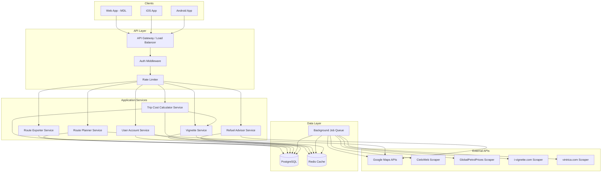
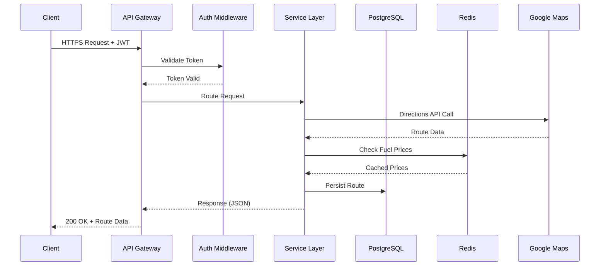
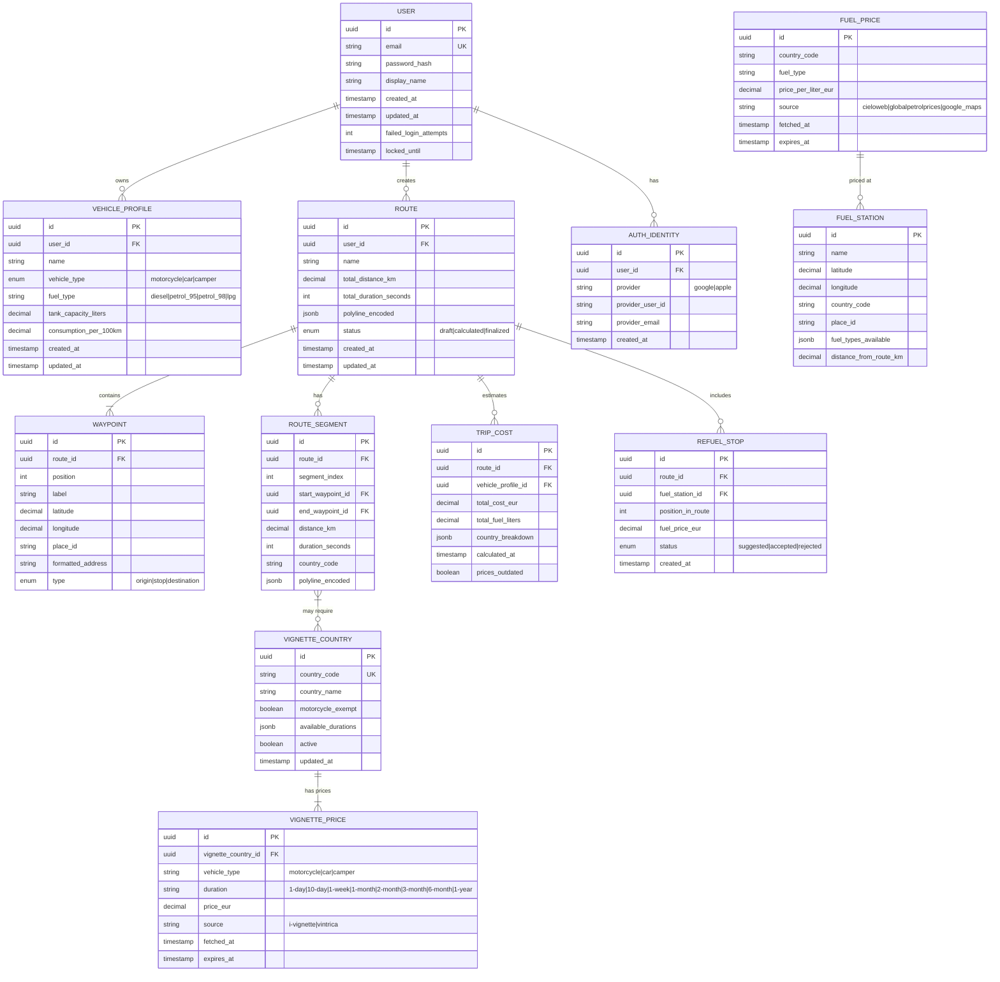

# Design Document: Route Planner Web Platform

## Overview

The Route Planner Web Platform is a multi-tier, API-first system that enables European travelers to plan multi-stop driving routes, estimate fuel costs, find optimal refueling stops, and export routes to GPS navigation formats. The platform serves web, iOS, and Android clients through a unified RESTful API backend.

The system is designed for 1 million users from day one, using PostgreSQL for persistence, Redis for caching, and Google Maps APIs for geocoding, directions, and places. Background workers handle fuel price scraping from multiple European sources. All prices are in EUR.

### Key Design Decisions

| Decision | Rationale |
|----------|-----------|
| API-first with versioned REST endpoints | Enables web + mobile clients to share a single backend; supports future third-party integrations |
| PostgreSQL + Redis | PostgreSQL for ACID-compliant relational data; Redis for sub-100ms fuel price lookups and session caching |
| Background job workers for fuel scraping | Decouples price data freshness from user request latency; enables retry/fallback logic |
| JWT-based stateless auth | Horizontal scaling without sticky sessions; 24-hour token expiry balances security and UX |
| Google Maps as sole map provider | Required constraint; provides Directions, Places, and Geocoding in a single SDK |
| Format-specific export strategy pattern | Each export format (GPX, ITN, etc.) has its own serializer implementing a common interface |
| Vignette price scraping with fallback | Scrapes from i-vignette.com (primary) and vintrica.com (secondary); caches in Redis with 24h TTL since prices change infrequently |
| Country-based vignette detection from route segments | Reuses existing route_segments.country_code to determine which countries require vignettes — no additional geocoding needed |

## Architecture

### High-Level System Architecture



### Request Flow



### Deployment Architecture

The system deploys as containerized microservices behind a load balancer:

- **API Gateway**: Nginx or cloud LB handling TLS termination, rate limiting
- **Application Servers**: Stateless service instances (horizontally scalable)
- **PostgreSQL**: Primary + read replicas for query distribution
- **Redis Cluster**: Multi-node for cache availability
- **Worker Pool**: Background job processors for fuel price scraping and vignette price scraping

## Components and Interfaces

### API Endpoints

#### Route Planning (`/api/v1/routes`)

| Method | Endpoint | Description |
|--------|----------|-------------|
| POST | `/api/v1/routes` | Create a new route with waypoints |
| GET | `/api/v1/routes/:id` | Retrieve a saved route |
| PUT | `/api/v1/routes/:id` | Update route waypoints |
| DELETE | `/api/v1/routes/:id` | Delete a saved route |
| POST | `/api/v1/routes/:id/calculate` | Trigger route calculation |
| GET | `/api/v1/routes/:id/alternatives` | Get alternative routes |
| POST | `/api/v1/routes/:id/export` | Export route in specified format |

#### Places & Geocoding (`/api/v1/places`)

| Method | Endpoint | Description |
|--------|----------|-------------|
| GET | `/api/v1/places/autocomplete?q={query}` | Place autocomplete (Europe-restricted) |
| GET | `/api/v1/places/geocode?address={address}` | Geocode an address |

#### Trip Cost (`/api/v1/trips`)

| Method | Endpoint | Description |
|--------|----------|-------------|
| POST | `/api/v1/trips/:routeId/cost` | Calculate trip cost for a route + vehicle |
| GET | `/api/v1/trips/:routeId/cost` | Get cached cost calculation |

#### Refuel Advisor (`/api/v1/refuel`)

| Method | Endpoint | Description |
|--------|----------|-------------|
| POST | `/api/v1/refuel/:routeId/suggest` | Get refuel stop suggestions |
| POST | `/api/v1/refuel/:routeId/accept/:stationId` | Accept a suggested stop |
| POST | `/api/v1/refuel/:routeId/reject/:stationId` | Reject a suggested stop |

#### Vehicle Profiles (`/api/v1/vehicles`)

| Method | Endpoint | Description |
|--------|----------|-------------|
| GET | `/api/v1/vehicles` | List user's vehicle profiles |
| POST | `/api/v1/vehicles` | Create a vehicle profile |
| PUT | `/api/v1/vehicles/:id` | Update a vehicle profile |
| DELETE | `/api/v1/vehicles/:id` | Delete a vehicle profile |

#### User Accounts (`/api/v1/auth`, `/api/v1/users`)

| Method | Endpoint | Description |
|--------|----------|-------------|
| POST | `/api/v1/auth/register` | Register with email/password |
| POST | `/api/v1/auth/login` | Login with email/password |
| POST | `/api/v1/auth/google` | Google SSO login |
| POST | `/api/v1/auth/apple` | Apple SSO login |
| POST | `/api/v1/auth/refresh` | Refresh JWT token |
| GET | `/api/v1/users/me` | Get current user profile |
| GET | `/api/v1/users/me/routes` | Get user's route history |

#### Fuel Prices (`/api/v1/fuel`)

| Method | Endpoint | Description |
|--------|----------|-------------|
| GET | `/api/v1/fuel/prices?country={code}&type={fuel_type}` | Get fuel prices |
| GET | `/api/v1/fuel/stations?lat={lat}&lng={lng}&radius={km}` | Find nearby stations |

#### Vignettes (`/api/v1/vignettes`)

| Method | Endpoint | Description |
|--------|----------|-------------|
| GET | `/api/v1/vignettes/countries` | List all countries requiring vignettes |
| GET | `/api/v1/vignettes/prices?country={code}&vehicle_type={type}` | Get vignette prices for a country and vehicle type |
| GET | `/api/v1/vignettes/route/:routeId` | Get vignette requirements for a calculated route |
| GET | `/api/v1/vignettes/route/:routeId/cost?duration={duration}` | Get vignette cost for a route with selected durations |

### Service Interfaces (Internal)

```typescript
// Route Planner Service
interface IRoutePlannerService {
  createRoute(userId: string, waypoints: Waypoint[]): Promise<Route>;
  calculateRoute(routeId: string): Promise<RouteCalculation>;
  getAlternatives(routeId: string): Promise<RouteCalculation[]>;
  addWaypoint(routeId: string, waypoint: Waypoint, position: number): Promise<Route>;
  removeWaypoint(routeId: string, waypointIndex: number): Promise<Route>;
  reorderWaypoints(routeId: string, newOrder: number[]): Promise<Route>;
}

// Trip Cost Calculator Service
interface ITripCostCalculatorService {
  calculateCost(routeId: string, vehicleId: string): Promise<TripCostEstimate>;
  calculateTotalCost(routeId: string, vehicleId: string, durationPreferences: Record<string, VignetteDuration>): Promise<TotalTripCostEstimate>;
  getCountryBreakdown(routeId: string, vehicleId: string): Promise<CountryCostBreakdown[]>;
}

// Refuel Advisor Service
interface IRefuelAdvisorService {
  suggestStops(routeId: string, vehicleId: string): Promise<RefuelSuggestion[]>;
  acceptStop(routeId: string, stationId: string): Promise<Route>;
  rejectStop(routeId: string, stationId: string): Promise<RefuelSuggestion>;
}

// Route Exporter Service
interface IRouteExporterService {
  export(routeId: string, format: ExportFormat): Promise<ExportedFile>;
  getSupportedFormats(): ExportFormat[];
}

// User Account Service
interface IUserAccountService {
  register(email: string, password: string, displayName: string): Promise<User>;
  login(email: string, password: string): Promise<AuthToken>;
  loginWithGoogle(idToken: string): Promise<AuthToken>;
  loginWithApple(authCode: string): Promise<AuthToken>;
  getProfile(userId: string): Promise<UserProfile>;
}

// Fuel Price Service (Background)
interface IFuelPriceService {
  scrapePrices(): Promise<void>;
  getPrice(country: string, fuelType: FuelType): Promise<FuelPrice>;
  getStationsNearRoute(routeSegments: RouteSegment[], radiusKm: number): Promise<FuelStation[]>;
}

// Vignette Service
interface IVignetteService {
  scrapeVignettePrices(): Promise<void>;
  getCountriesRequiringVignette(): Promise<VignetteCountry[]>;
  getPrices(countryCode: string, vehicleType: VehicleType): Promise<VignettePrice[]>;
  getRouteVignetteRequirements(routeId: string): Promise<RouteVignetteRequirement[]>;
  calculateVignetteCost(
    routeId: string,
    vehicleType: VehicleType,
    durationPreferences: Record<string, VignetteDuration>
  ): Promise<VignetteCostEstimate>;
}

// Vignette Types
type VehicleType = 'motorcycle' | 'car' | 'camper';
type VignetteDuration = '1-day' | '10-day' | '1-week' | '1-month' | '2-month' | '3-month' | '6-month' | '1-year';

interface VignetteCountry {
  countryCode: string;
  countryName: string;
  availableDurations: VignetteDuration[];
  vehicleCategories: VehicleType[];
  motorcycleExempt: boolean; // Some countries exempt motorcycles (e.g., Romania)
}

interface VignettePrice {
  countryCode: string;
  vehicleType: VehicleType;
  duration: VignetteDuration;
  priceEur: number;
  source: 'i-vignette' | 'vintrica';
  fetchedAt: Date;
}

interface RouteVignetteRequirement {
  countryCode: string;
  countryName: string;
  required: boolean;
  motorcycleExempt: boolean;
  availableDurations: VignetteDuration[];
  prices: VignettePrice[];
}

interface VignetteCostEstimate {
  totalVignetteCostEur: number;
  countryBreakdown: {
    countryCode: string;
    countryName: string;
    selectedDuration: VignetteDuration;
    costEur: number;
  }[];
}
```

### Export Format Strategy Pattern

```typescript
interface IRouteFormatExporter {
  format: ExportFormat;
  maxWaypoints: number | null; // null = unlimited
  export(route: Route): Buffer;
  validate(route: Route): ValidationResult;
}

// Implementations
class GpxExporter implements IRouteFormatExporter { /* ... */ }
class ItnExporter implements IRouteFormatExporter { /* ... */ }
class AscExporter implements IRouteFormatExporter { /* ... */ }
class Ov2Exporter implements IRouteFormatExporter { /* ... */ }
class BcrExporter implements IRouteFormatExporter { /* ... */ }
class TrkExporter implements IRouteFormatExporter { /* ... */ }
class MpsExporter implements IRouteFormatExporter { /* ... */ }
class FitExporter implements IRouteFormatExporter { /* ... */ }
```


## Data Models

### Entity Relationship Diagram



### PostgreSQL Schema (Key Tables)

```sql
-- Users
CREATE TABLE users (
    id UUID PRIMARY KEY DEFAULT gen_random_uuid(),
    email VARCHAR(255) UNIQUE NOT NULL,
    password_hash VARCHAR(255), -- NULL for SSO-only users
    display_name VARCHAR(100) NOT NULL,
    failed_login_attempts INT DEFAULT 0,
    locked_until TIMESTAMP,
    created_at TIMESTAMP DEFAULT NOW(),
    updated_at TIMESTAMP DEFAULT NOW()
);

CREATE INDEX idx_users_email ON users(email);

-- Auth Identities (SSO providers)
CREATE TABLE auth_identities (
    id UUID PRIMARY KEY DEFAULT gen_random_uuid(),
    user_id UUID NOT NULL REFERENCES users(id) ON DELETE CASCADE,
    provider VARCHAR(20) NOT NULL, -- 'google' | 'apple'
    provider_user_id VARCHAR(255) NOT NULL,
    provider_email VARCHAR(255),
    created_at TIMESTAMP DEFAULT NOW(),
    UNIQUE(provider, provider_user_id)
);

-- Vehicle Profiles
CREATE TABLE vehicle_profiles (
    id UUID PRIMARY KEY DEFAULT gen_random_uuid(),
    user_id UUID NOT NULL REFERENCES users(id) ON DELETE CASCADE,
    name VARCHAR(100) NOT NULL,
    vehicle_type VARCHAR(20) NOT NULL CHECK (vehicle_type IN ('motorcycle', 'car', 'camper')),
    fuel_type VARCHAR(20) NOT NULL CHECK (fuel_type IN ('diesel', 'petrol_95', 'petrol_98', 'lpg')),
    tank_capacity_liters DECIMAL(5,1) NOT NULL CHECK (tank_capacity_liters BETWEEN 5 AND 200),
    consumption_per_100km DECIMAL(4,1) NOT NULL CHECK (consumption_per_100km BETWEEN 1 AND 50),
    created_at TIMESTAMP DEFAULT NOW(),
    updated_at TIMESTAMP DEFAULT NOW()
);

CREATE INDEX idx_vehicle_profiles_user ON vehicle_profiles(user_id);

-- Routes
CREATE TABLE routes (
    id UUID PRIMARY KEY DEFAULT gen_random_uuid(),
    user_id UUID NOT NULL REFERENCES users(id) ON DELETE CASCADE,
    name VARCHAR(200),
    total_distance_km DECIMAL(10,2),
    total_duration_seconds INT,
    polyline_encoded TEXT,
    status VARCHAR(20) DEFAULT 'draft' CHECK (status IN ('draft', 'calculated', 'finalized')),
    created_at TIMESTAMP DEFAULT NOW(),
    updated_at TIMESTAMP DEFAULT NOW()
);

CREATE INDEX idx_routes_user_created ON routes(user_id, created_at DESC);

-- Waypoints
CREATE TABLE waypoints (
    id UUID PRIMARY KEY DEFAULT gen_random_uuid(),
    route_id UUID NOT NULL REFERENCES routes(id) ON DELETE CASCADE,
    position INT NOT NULL,
    label VARCHAR(200),
    latitude DECIMAL(10,7) NOT NULL,
    longitude DECIMAL(10,7) NOT NULL,
    place_id VARCHAR(255),
    formatted_address VARCHAR(500),
    waypoint_type VARCHAR(20) NOT NULL CHECK (waypoint_type IN ('origin', 'stop', 'destination')),
    UNIQUE(route_id, position)
);

CREATE INDEX idx_waypoints_route ON waypoints(route_id, position);

-- Route Segments
CREATE TABLE route_segments (
    id UUID PRIMARY KEY DEFAULT gen_random_uuid(),
    route_id UUID NOT NULL REFERENCES routes(id) ON DELETE CASCADE,
    segment_index INT NOT NULL,
    start_waypoint_id UUID REFERENCES waypoints(id),
    end_waypoint_id UUID REFERENCES waypoints(id),
    distance_km DECIMAL(10,2) NOT NULL,
    duration_seconds INT NOT NULL,
    country_code VARCHAR(2) NOT NULL,
    polyline_encoded TEXT,
    UNIQUE(route_id, segment_index)
);

-- Fuel Prices (cached from scraping)
CREATE TABLE fuel_prices (
    id UUID PRIMARY KEY DEFAULT gen_random_uuid(),
    country_code VARCHAR(2) NOT NULL,
    fuel_type VARCHAR(20) NOT NULL,
    price_per_liter_eur DECIMAL(5,3) NOT NULL,
    source VARCHAR(30) NOT NULL,
    fetched_at TIMESTAMP NOT NULL DEFAULT NOW(),
    expires_at TIMESTAMP NOT NULL,
    UNIQUE(country_code, fuel_type, source)
);

CREATE INDEX idx_fuel_prices_lookup ON fuel_prices(country_code, fuel_type, expires_at);

-- Trip Cost Estimates
CREATE TABLE trip_costs (
    id UUID PRIMARY KEY DEFAULT gen_random_uuid(),
    route_id UUID NOT NULL REFERENCES routes(id) ON DELETE CASCADE,
    vehicle_profile_id UUID NOT NULL REFERENCES vehicle_profiles(id),
    total_cost_eur DECIMAL(8,2) NOT NULL,
    total_fuel_liters DECIMAL(8,2) NOT NULL,
    country_breakdown JSONB NOT NULL DEFAULT '[]',
    calculated_at TIMESTAMP DEFAULT NOW(),
    prices_outdated BOOLEAN DEFAULT FALSE
);

-- Fuel Stations
CREATE TABLE fuel_stations (
    id UUID PRIMARY KEY DEFAULT gen_random_uuid(),
    name VARCHAR(200) NOT NULL,
    latitude DECIMAL(10,7) NOT NULL,
    longitude DECIMAL(10,7) NOT NULL,
    country_code VARCHAR(2) NOT NULL,
    place_id VARCHAR(255),
    fuel_types_available JSONB DEFAULT '[]'
);

CREATE INDEX idx_fuel_stations_location ON fuel_stations USING GIST (
    ST_MakePoint(longitude, latitude)
);

-- Refuel Stops
CREATE TABLE refuel_stops (
    id UUID PRIMARY KEY DEFAULT gen_random_uuid(),
    route_id UUID NOT NULL REFERENCES routes(id) ON DELETE CASCADE,
    fuel_station_id UUID NOT NULL REFERENCES fuel_stations(id),
    position_in_route INT NOT NULL,
    fuel_price_eur DECIMAL(5,3),
    status VARCHAR(20) DEFAULT 'suggested' CHECK (status IN ('suggested', 'accepted', 'rejected')),
    created_at TIMESTAMP DEFAULT NOW()
);

-- Vignette Countries (which countries require vignettes)
CREATE TABLE vignette_countries (
    id UUID PRIMARY KEY DEFAULT gen_random_uuid(),
    country_code VARCHAR(2) UNIQUE NOT NULL,
    country_name VARCHAR(100) NOT NULL,
    motorcycle_exempt BOOLEAN DEFAULT FALSE,
    available_durations JSONB NOT NULL DEFAULT '[]',
    active BOOLEAN DEFAULT TRUE,
    updated_at TIMESTAMP DEFAULT NOW()
);

-- Seed data for known vignette countries
-- AT (Austria), BG (Bulgaria), CZ (Czech Republic), HU (Hungary),
-- MD (Moldova), RO (Romania), SK (Slovakia), SI (Slovenia), CH (Switzerland)

-- Vignette Prices (scraped pricing data)
CREATE TABLE vignette_prices (
    id UUID PRIMARY KEY DEFAULT gen_random_uuid(),
    vignette_country_id UUID NOT NULL REFERENCES vignette_countries(id) ON DELETE CASCADE,
    vehicle_type VARCHAR(20) NOT NULL CHECK (vehicle_type IN ('motorcycle', 'car', 'camper')),
    duration VARCHAR(20) NOT NULL CHECK (duration IN ('1-day', '10-day', '1-week', '1-month', '2-month', '3-month', '6-month', '1-year')),
    price_eur DECIMAL(7,2) NOT NULL,
    source VARCHAR(30) NOT NULL CHECK (source IN ('i-vignette', 'vintrica')),
    fetched_at TIMESTAMP NOT NULL DEFAULT NOW(),
    expires_at TIMESTAMP NOT NULL,
    UNIQUE(vignette_country_id, vehicle_type, duration, source)
);

CREATE INDEX idx_vignette_prices_lookup ON vignette_prices(vignette_country_id, vehicle_type, duration);
CREATE INDEX idx_vignette_countries_code ON vignette_countries(country_code);
```

### Redis Cache Schema

| Key Pattern | Value | TTL |
|-------------|-------|-----|
| `fuel:price:{country}:{fuel_type}` | `{ price, source, fetchedAt }` | 6 hours |
| `route:calc:{route_id}` | Serialized route calculation result | 1 hour |
| `session:{user_id}` | JWT metadata + refresh token | 24 hours |
| `rate_limit:{user_id}` | Request counter | 1 minute |
| `login_attempts:{email}` | Failed attempt counter | 15 minutes |
| `places:autocomplete:{query_hash}` | Autocomplete results | 30 minutes |
| `vignette:prices:{country}:{vehicle_type}` | `[{ duration, priceEur, source, fetchedAt }]` | 24 hours |
| `vignette:countries` | List of countries requiring vignettes | 24 hours |
| `vignette:route:{route_id}` | Vignette requirements for a route | 1 hour |

### Low-Level Design: Core Algorithms

#### Trip Cost Calculation Algorithm

```typescript
function calculateTripCost(
  segments: RouteSegment[],
  vehicle: VehicleProfile
): TripCostEstimate {
  let totalCost = 0;
  let totalFuelLiters = 0;
  const countryBreakdown: CountryCostBreakdown[] = [];

  for (const segment of segments) {
    const fuelNeeded = (segment.distanceKm / 100) * vehicle.consumptionPer100km;
    const fuelPrice = getFuelPrice(segment.countryCode, vehicle.fuelType);

    const segmentCost = fuelNeeded * fuelPrice.pricePerLiterEur;
    totalCost += segmentCost;
    totalFuelLiters += fuelNeeded;

    // Aggregate by country
    const existing = countryBreakdown.find(c => c.countryCode === segment.countryCode);
    if (existing) {
      existing.distanceKm += segment.distanceKm;
      existing.fuelLiters += fuelNeeded;
      existing.costEur += segmentCost;
    } else {
      countryBreakdown.push({
        countryCode: segment.countryCode,
        distanceKm: segment.distanceKm,
        fuelLiters: fuelNeeded,
        costEur: segmentCost,
        pricePerLiter: fuelPrice.pricePerLiterEur,
      });
    }
  }

  return {
    totalCostEur: Math.round(totalCost * 100) / 100,
    totalFuelLiters: Math.round(totalFuelLiters * 100) / 100,
    countryBreakdown,
    pricesOutdated: segments.some(s =>
      isFuelPriceOutdated(s.countryCode, vehicle.fuelType)
    ),
  };
}
```

#### Refuel Stop Suggestion Algorithm

```typescript
function suggestRefuelStops(
  route: Route,
  vehicle: VehicleProfile
): RefuelSuggestion[] {
  const maxRangeKm = (vehicle.tankCapacityLiters / vehicle.consumptionPer100km) * 100;
  const refuelThresholdKm = maxRangeKm * 0.85; // Refuel at 15% remaining
  const suggestions: RefuelSuggestion[] = [];

  let distanceSinceLastFuel = 0;

  for (const segment of route.segments) {
    distanceSinceLastFuel += segment.distanceKm;

    if (distanceSinceLastFuel >= refuelThresholdKm) {
      // Find stations near this point on the route
      const midpoint = getSegmentMidpoint(segment);
      let stations = findStationsNearPoint(midpoint, radiusKm: 2);

      // Expand search if no stations found within 2km
      if (stations.length === 0) {
        stations = findStationsNearPoint(midpoint, radiusKm: 5);
      }
      if (stations.length === 0) {
        stations = findStationsNearPoint(midpoint, radiusKm: 10);
      }

      // Rank by price (lowest first)
      stations.sort((a, b) => a.fuelPrice - b.fuelPrice);

      if (stations.length > 0) {
        suggestions.push({
          station: stations[0],
          alternatives: stations.slice(1, 3),
          distanceFromStart: getTotalDistanceToPoint(route, segment),
          reason: distanceSinceLastFuel >= refuelThresholdKm
            ? 'range_warning'
            : 'price_opportunity',
          expandedSearch: stations[0].distanceFromRouteKm > 5,
        });
        distanceSinceLastFuel = 0; // Reset after suggested stop
      }
    }
  }

  return suggestions;
}
```

#### Route Export — GPX Format Example

```typescript
function exportToGpx(route: Route): Buffer {
  const waypoints = route.waypoints.map(wp => `
    <wpt lat="${wp.latitude}" lon="${wp.longitude}">
      <name>${escapeXml(wp.label)}</name>
      <desc>${escapeXml(wp.formattedAddress)}</desc>
    </wpt>`).join('\n');

  const trackPoints = route.segments.flatMap(seg =>
    decodePolyline(seg.polylineEncoded).map(point =>
      `      <trkpt lat="${point.lat}" lon="${point.lng}"></trkpt>`
    )
  ).join('\n');

  const gpx = `<?xml version="1.0" encoding="UTF-8"?>
<gpx version="1.1" creator="RoutePlanner">
  <metadata>
    <name>${escapeXml(route.name)}</name>
    <time>${new Date().toISOString()}</time>
  </metadata>
  ${waypoints}
  <trk>
    <name>${escapeXml(route.name)}</name>
    <trkseg>
${trackPoints}
    </trkseg>
  </trk>
</gpx>`;

  return Buffer.from(gpx, 'utf-8');
}
```

#### Fuel Price Scraping — Fallback Chain

```typescript
async function scrapeFuelPrices(): Promise<void> {
  const countries = getEuropeanCountryCodes();

  for (const country of countries) {
    for (const fuelType of FUEL_TYPES) {
      let price: FuelPrice | null = null;

      // Priority 1: CieloWeb
      try {
        price = await scrapeCieloWeb(country, fuelType);
        price.source = 'cieloweb';
      } catch (e) {
        logger.warn(`CieloWeb failed for ${country}/${fuelType}`, e);
      }

      // Priority 2: GlobalPetrolPrices
      if (!price) {
        try {
          price = await scrapeGlobalPetrolPrices(country, fuelType);
          price.source = 'globalpetrolprices';
        } catch (e) {
          logger.warn(`GlobalPetrolPrices failed for ${country}/${fuelType}`, e);
        }
      }

      // Priority 3: Google Maps
      if (!price) {
        try {
          price = await fetchGoogleMapsFuelPrice(country, fuelType);
          price.source = 'google_maps';
        } catch (e) {
          logger.warn(`Google Maps failed for ${country}/${fuelType}`, e);
        }
      }

      if (price) {
        await cacheFuelPrice(country, fuelType, price);
        await persistFuelPrice(country, fuelType, price);
      } else {
        // Retain existing price, log alert
        logger.alert(`All fuel price sources failed for ${country}/${fuelType}`);
      }
    }
  }
}
```

#### Password Validation

```typescript
function validatePassword(password: string): ValidationResult {
  const errors: string[] = [];

  if (password.length < 8) {
    errors.push('Password must be at least 8 characters');
  }
  if (!/[A-Z]/.test(password)) {
    errors.push('Password must contain at least one uppercase letter');
  }
  if (!/[a-z]/.test(password)) {
    errors.push('Password must contain at least one lowercase letter');
  }
  if (!/[0-9]/.test(password)) {
    errors.push('Password must contain at least one digit');
  }

  return { valid: errors.length === 0, errors };
}
```

#### Rate Limiting (Token Bucket via Redis)

```typescript
async function checkRateLimit(userId: string): Promise<boolean> {
  const key = `rate_limit:${userId}`;
  const limit = 100; // requests per minute
  const windowSeconds = 60;

  const current = await redis.incr(key);
  if (current === 1) {
    await redis.expire(key, windowSeconds);
  }

  return current <= limit;
}
```

#### Vignette Cost Calculation Algorithm

```typescript
// Countries that require a vignette (ISO 3166-1 alpha-2)
const VIGNETTE_COUNTRIES = new Set(['AT', 'BG', 'CZ', 'HU', 'MD', 'RO', 'SK', 'SI', 'CH']);

// Countries where motorcycles are exempt from vignette
const MOTORCYCLE_EXEMPT_COUNTRIES = new Set(['RO', 'BG']);

interface VignetteDurationPreference {
  countryCode: string;
  duration: VignetteDuration;
}

function getRouteVignetteRequirements(
  segments: RouteSegment[],
  vehicleType: VehicleType
): RouteVignetteRequirement[] {
  // Extract unique countries from route segments
  const countriesOnRoute = new Set(segments.map(s => s.countryCode));

  // Filter to countries that require vignettes
  const vignetteCountries = [...countriesOnRoute].filter(c => VIGNETTE_COUNTRIES.has(c));

  return vignetteCountries.map(countryCode => {
    const isExempt = vehicleType === 'motorcycle' && MOTORCYCLE_EXEMPT_COUNTRIES.has(countryCode);
    const prices = getVignettePrices(countryCode, vehicleType);

    return {
      countryCode,
      countryName: getCountryName(countryCode),
      required: !isExempt,
      motorcycleExempt: MOTORCYCLE_EXEMPT_COUNTRIES.has(countryCode),
      availableDurations: prices.map(p => p.duration),
      prices,
    };
  });
}

function calculateVignetteCost(
  requirements: RouteVignetteRequirement[],
  durationPreferences: Record<string, VignetteDuration>
): VignetteCostEstimate {
  const countryBreakdown = requirements
    .filter(r => r.required)
    .map(req => {
      const selectedDuration = durationPreferences[req.countryCode] || getDefaultDuration(req);
      const price = req.prices.find(p => p.duration === selectedDuration);

      return {
        countryCode: req.countryCode,
        countryName: req.countryName,
        selectedDuration,
        costEur: price ? price.priceEur : 0,
      };
    });

  const totalVignetteCostEur = Math.round(
    countryBreakdown.reduce((sum, c) => sum + c.costEur, 0) * 100
  ) / 100;

  return { totalVignetteCostEur, countryBreakdown };
}

function getDefaultDuration(requirement: RouteVignetteRequirement): VignetteDuration {
  // Default to shortest available duration (cheapest for transit)
  const priorityOrder: VignetteDuration[] = [
    '1-day', '1-week', '10-day', '1-month', '2-month', '3-month', '6-month', '1-year'
  ];
  return priorityOrder.find(d => requirement.availableDurations.includes(d)) || '10-day';
}
```

#### Vignette Price Scraping — Fallback Chain

```typescript
async function scrapeVignettePrices(): Promise<void> {
  const vignetteCountries = await getActiveVignetteCountries();

  for (const country of vignetteCountries) {
    for (const vehicleType of VEHICLE_TYPES) {
      // Skip motorcycle for exempt countries
      if (vehicleType === 'motorcycle' && MOTORCYCLE_EXEMPT_COUNTRIES.has(country.countryCode)) {
        continue;
      }

      let prices: VignettePrice[] | null = null;

      // Priority 1: i-vignette.com
      try {
        prices = await scrapeIVignette(country.countryCode, vehicleType);
        prices.forEach(p => p.source = 'i-vignette');
      } catch (e) {
        logger.warn(`i-vignette.com failed for ${country.countryCode}/${vehicleType}`, e);
      }

      // Priority 2: vintrica.com
      if (!prices || prices.length === 0) {
        try {
          prices = await scrapeVintrica(country.countryCode, vehicleType);
          prices.forEach(p => p.source = 'vintrica');
        } catch (e) {
          logger.warn(`vintrica.com failed for ${country.countryCode}/${vehicleType}`, e);
        }
      }

      if (prices && prices.length > 0) {
        await cacheVignettePrices(country.countryCode, vehicleType, prices);
        await persistVignettePrices(country.countryCode, vehicleType, prices);
      } else {
        // Retain existing prices, log alert
        logger.alert(`All vignette price sources failed for ${country.countryCode}/${vehicleType}`);
      }
    }
  }
}
```

#### Updated Trip Cost with Vignette Integration

```typescript
interface TotalTripCostEstimate {
  fuelCost: TripCostEstimate;
  vignetteCost: VignetteCostEstimate;
  totalTripCostEur: number; // fuel + vignettes combined
}

function calculateTotalTripCost(
  segments: RouteSegment[],
  vehicle: VehicleProfile,
  durationPreferences: Record<string, VignetteDuration>
): TotalTripCostEstimate {
  // Calculate fuel cost (existing logic)
  const fuelCost = calculateTripCost(segments, vehicle);

  // Calculate vignette cost
  const vignetteRequirements = getRouteVignetteRequirements(segments, vehicle.vehicleType);
  const vignetteCost = calculateVignetteCost(vignetteRequirements, durationPreferences);

  return {
    fuelCost,
    vignetteCost,
    totalTripCostEur: Math.round(
      (fuelCost.totalCostEur + vignetteCost.totalVignetteCostEur) * 100
    ) / 100,
  };
}
```


## Correctness Properties

*A property is a characteristic or behavior that should hold true across all valid executions of a system — essentially, a formal statement about what the system should do. Properties serve as the bridge between human-readable specifications and machine-verifiable correctness guarantees.*

### Property 1: Waypoint Insertion Preserves and Grows

*For any* valid route with N waypoints and any valid waypoint to insert at any valid position P, inserting the waypoint SHALL result in a route with N+1 waypoints where the new waypoint is at position P and all other waypoints retain their relative order.

**Validates: Requirements 1.3**

### Property 2: Waypoint Reorder Preserves Set

*For any* valid route and any valid permutation of its intermediate stops, reordering SHALL produce a route containing exactly the same set of waypoints (same coordinates and labels) in the new specified order, with origin and destination unchanged.

**Validates: Requirements 1.4**

### Property 3: Waypoint Removal Shrinks and Excludes

*For any* valid route with N waypoints (N > 2) and any removable waypoint, removing it SHALL result in a route with N-1 waypoints where the removed waypoint is absent and all remaining waypoints retain their relative order.

**Validates: Requirements 1.5**

### Property 4: Failed Geocoding Preserves Route State

*For any* existing route state, when a geocoding request fails, the route's waypoints, segments, and calculated data SHALL remain identical to the state before the failed request.

**Validates: Requirements 1.7**

### Property 5: Autocomplete Triggers Only After Minimum Characters

*For any* input string, the autocomplete service SHALL return suggestions only when the string length is >= 3 characters, and SHALL return an empty result for strings shorter than 3 characters.

**Validates: Requirements 3.1**

### Property 6: Autocomplete Results Restricted to Europe

*For any* autocomplete query, all returned place suggestions SHALL have country codes within the set of European countries.

**Validates: Requirements 3.3**

### Property 7: Route Segments Match Waypoint Count

*For any* calculated route with N waypoints, the route SHALL contain exactly N-1 segments, each with a positive distance_km and positive duration_seconds.

**Validates: Requirements 4.5**

### Property 8: Vehicle Profile Round-Trip

*For any* valid vehicle profile (vehicle_type in {motorcycle, car, camper}, tank_capacity in [5, 200], consumption in [1, 50]), storing and then retrieving the profile SHALL produce an identical record.

**Validates: Requirements 5.1**

### Property 9: Vehicle Profile Validation Boundaries

*For any* numeric value for tank_capacity, values in [5, 200] SHALL be accepted and values outside this range SHALL be rejected. For any numeric value for consumption_per_100km, values in [1, 50] SHALL be accepted and values outside SHALL be rejected. Rejected submissions SHALL return specific validation error messages.

**Validates: Requirements 5.2, 5.3, 5.6**

### Property 10: Fuel Price Fallback Chain

*For any* country and fuel type combination, the Fuel_Price_Service SHALL attempt sources in order (CieloWeb → GlobalPetrolPrices → Google Maps), using the first successful source. If a higher-priority source fails, the next source SHALL be attempted.

**Validates: Requirements 6.2, 6.3**

### Property 11: Fuel Price Retention on Total Failure

*For any* state where valid fuel prices exist, if all scraping sources fail, the existing cached prices SHALL remain unchanged and accessible.

**Validates: Requirements 6.7**

### Property 12: Trip Cost Calculation Correctness

*For any* set of route segments with known distances and country codes, any valid vehicle profile, and any set of fuel prices, the total trip cost SHALL equal the sum of (segment_distance_km / 100 × consumption_per_100km × country_fuel_price_eur) for each segment, rounded to 2 decimal places.

**Validates: Requirements 7.1, 7.2, 7.3**

### Property 13: Country Cost Breakdown Sums to Total

*For any* multi-country trip cost calculation, the sum of all per-country cost values SHALL equal the total trip cost (within floating-point rounding tolerance of 0.01 EUR).

**Validates: Requirements 7.4**

### Property 14: Outdated Price Warning

*For any* trip cost calculation, if any fuel price used in the calculation has a fetched_at timestamp older than 12 hours, the result SHALL include a prices_outdated flag set to true.

**Validates: Requirements 7.5**

### Property 15: Refuel Stop Safety Invariant

*For any* route and vehicle profile, the distance between any two consecutive refuel points (or between start and first refuel, or last refuel and destination) SHALL NOT exceed 85% of the vehicle's maximum range (tank_capacity / consumption_per_100km × 100).

**Validates: Requirements 8.1, 8.2**

### Property 16: Refuel Station Ranking by Price

*For any* set of candidate fuel stations at a refuel point, the suggestions SHALL be ordered by fuel price ascending (lowest price first).

**Validates: Requirements 8.4**

### Property 17: Refuel Search Radius Expansion

*For any* required refuel point where no fuel stations exist within 5 km of the route, the search SHALL expand to 10 km radius.

**Validates: Requirements 8.7**

### Property 18: Export Round-Trip Waypoint Preservation

*For any* valid route and any supported export format, exporting the route and then parsing the exported file SHALL produce a set of waypoints equivalent to the original route's waypoints (same coordinates within GPS precision tolerance).

**Validates: Requirements 9.3, 9.4, 9.6, 9.7**

### Property 19: Export File Splitting on Format Limit

*For any* route with more waypoints than a format's maximum, the export SHALL produce multiple files whose combined waypoints equal the complete original route waypoint set.

**Validates: Requirements 9.5**

### Property 20: Password Validation Rules

*For any* string, it SHALL be accepted as a valid password if and only if it has length >= 8, contains at least one uppercase letter, at least one lowercase letter, and at least one digit.

**Validates: Requirements 10.3**

### Property 21: Email Uniqueness Enforcement

*For any* email address that already exists in the system, attempting to register a new account with that same email SHALL be rejected.

**Validates: Requirements 10.2**

### Property 22: SSO Account Linking (No Duplicates)

*For any* SSO login where the provider's verified email matches an existing account's email, the system SHALL link the SSO identity to the existing account rather than creating a new account. The total user count SHALL NOT increase.

**Validates: Requirements 10.7**

### Property 23: JWT Expiry Correctness

*For any* successful authentication (email/password or SSO), the issued JWT token SHALL have an expiry timestamp exactly 24 hours from the time of issuance.

**Validates: Requirements 10.8**

### Property 24: Generic Authentication Error

*For any* failed login attempt (whether due to wrong email or wrong password), the error response SHALL be identical in structure and message content, not revealing which credential was incorrect.

**Validates: Requirements 10.9**

### Property 25: Account Lockout After Failed Attempts

*For any* account, if 5 or more failed authentication attempts occur within a 15-minute window, the account SHALL be locked for 30 minutes. Fewer than 5 failures SHALL NOT trigger a lockout.

**Validates: Requirements 10.10**

### Property 26: Route History Ordering

*For any* user's route history, routes SHALL be returned sorted by creation date in descending order (newest first).

**Validates: Requirements 11.3**

### Property 27: Route Deletion Permanence

*For any* deleted route, subsequent retrieval attempts SHALL return a not-found error. The route SHALL NOT appear in the user's history.

**Validates: Requirements 11.5**

### Property 28: Authentication Required for Protected Endpoints

*For any* API request to an endpoint other than registration or login, if no valid authentication token is provided, the API SHALL return a 401 Unauthorized status code.

**Validates: Requirements 13.1, 13.5**

### Property 29: Password Hash Security

*For any* stored user password, the hash SHALL use bcrypt with a cost factor of at least 12. The original password SHALL NOT be recoverable from any API response.

**Validates: Requirements 13.2, 13.6**

### Property 30: Input Sanitization

*For any* user input containing SQL injection patterns, XSS scripts, or other injection attack vectors, the system SHALL either sanitize the input or reject the request — never execute the malicious content.

**Validates: Requirements 13.4**

### Property 31: Consistent API Error Structure

*For any* API error response, the response body SHALL contain a JSON object with at minimum a `status` code field and a `message` field, following a consistent structure across all endpoints.

**Validates: Requirements 14.2**

### Property 32: Rate Limiting Enforcement

*For any* authenticated user making more than 100 requests within a 60-second window, requests exceeding the limit SHALL be rejected with a 429 Too Many Requests status code.

**Validates: Requirements 14.5**

### Property 33: Vignette Country Detection with Motorcycle Exemption

*For any* calculated route with segments crossing multiple countries and any vehicle type, the system SHALL identify exactly those countries that are in the vignette-required set (AT, BG, CZ, HU, MD, RO, SK, SI, CH). For motorcycle vehicle types, countries in the motorcycle-exempt set (RO, BG) SHALL be marked as not required.

**Validates: Requirements 16.1, 16.6**

### Property 34: Total Trip Cost Includes Vignettes

*For any* route with a valid fuel cost estimate and vignette cost estimate, the total trip cost SHALL equal the sum of the fuel cost and the total vignette cost, rounded to 2 decimal places.

**Validates: Requirements 16.3**

### Property 35: Vignette Price Fallback Chain

*For any* country and vehicle type combination, the Vignette_Service SHALL attempt price sources in order (i-vignette.com → vintrica.com), using the first successful source. If the primary source fails, the secondary source SHALL be attempted.

**Validates: Requirements 16.4**

### Property 36: Vignette Duration Preference Respected

*For any* vignette cost calculation where the user has selected a specific duration for a country, the cost for that country SHALL equal the price corresponding to the selected duration and vehicle type. If no preference is specified, the shortest available duration SHALL be used as default.

**Validates: Requirements 16.5**

### Property 37: Vignette Price Retention on Total Failure

*For any* state where valid vignette prices exist in the cache, if all scraping sources fail, the existing cached prices SHALL remain unchanged and accessible.

**Validates: Requirements 16.7**

### Property 38: Vignette Country Breakdown Sums to Total

*For any* vignette cost calculation spanning multiple countries, the sum of all per-country vignette costs SHALL equal the total vignette cost (within floating-point rounding tolerance of 0.01 EUR).

**Validates: Requirements 16.8**

## Error Handling

### Error Response Format

All API errors follow a consistent JSON structure:

```json
{
  "status": 400,
  "error": "VALIDATION_ERROR",
  "message": "Human-readable error description",
  "details": [
    { "field": "tank_capacity", "message": "Must be between 5 and 200 liters" }
  ],
  "requestId": "uuid-for-tracing"
}
```

### Error Categories

| HTTP Status | Error Code | Description |
|-------------|-----------|-------------|
| 400 | VALIDATION_ERROR | Invalid input data |
| 401 | UNAUTHORIZED | Missing or expired token |
| 403 | FORBIDDEN | Insufficient permissions |
| 404 | NOT_FOUND | Resource does not exist |
| 409 | CONFLICT | Duplicate resource (e.g., email already registered) |
| 422 | UNPROCESSABLE | Valid syntax but semantic error (e.g., route cannot be calculated) |
| 429 | RATE_LIMITED | Too many requests |
| 500 | INTERNAL_ERROR | Unexpected server error |
| 502 | UPSTREAM_ERROR | External API failure (Google Maps, scrapers) |
| 503 | SERVICE_UNAVAILABLE | System overloaded or in maintenance |

### Retry and Fallback Strategy

| Component | Failure Mode | Handling |
|-----------|-------------|----------|
| Google Maps Geocoding | API error / timeout | Return error to user, retain previous route state |
| Google Maps Directions | No route found | Return specific error message |
| CieloWeb Scraper | Scrape failure | Fall back to GlobalPetrolPrices |
| GlobalPetrolPrices Scraper | Scrape failure | Fall back to Google Maps fuel data |
| All fuel sources | Total failure | Retain cached prices, log alert, set outdated flag |
| i-vignette.com Scraper | Scrape failure | Fall back to vintrica.com |
| vintrica.com Scraper | Scrape failure | Retain cached vignette prices, log alert |
| Vignette price lookup | No prices for country/vehicle | Return empty prices array with warning |
| Redis Cache | Connection failure | Fall through to PostgreSQL (degraded performance) |
| PostgreSQL | Connection failure | Return 503, trigger health check alert |
| JWT Validation | Token expired | Return 401, client should refresh or re-authenticate |
| Rate Limiter | Limit exceeded | Return 429 with Retry-After header |

### Circuit Breaker Pattern

External API calls (Google Maps, fuel scrapers) use a circuit breaker:
- **Closed**: Normal operation, requests pass through
- **Open**: After 5 consecutive failures, reject requests immediately for 60 seconds
- **Half-Open**: After timeout, allow one test request to determine recovery

## Testing Strategy

### Testing Pyramid

```
         ╱╲
        ╱  ╲       E2E Tests (5%)
       ╱────╲      - Full user flows across web/mobile
      ╱      ╲
     ╱────────╲    Integration Tests (25%)
    ╱          ╲   - API endpoint tests with real DB
   ╱────────────╲  - Google Maps API mock tests
  ╱              ╲ - Redis cache integration
 ╱────────────────╲
╱                  ╲ Unit + Property Tests (70%)
╱────────────────────╲ - Pure function logic
                        - Validation rules
                        - Export format serialization
                        - Cost calculation algorithms
```

### Property-Based Testing

**Library**: [fast-check](https://github.com/dubzzz/fast-check) (TypeScript/JavaScript)

**Configuration**:
- Minimum 100 iterations per property test
- Each property test references its design document property number
- Tag format: `Feature: route-planner-platform, Property {N}: {title}`

**Key property test areas**:
1. **Route manipulation** (Properties 1-4): Waypoint insertion, removal, reordering invariants
2. **Validation** (Properties 5, 9, 20, 21): Input boundary testing with generated values
3. **Cost calculation** (Properties 12-14): Mathematical correctness across random inputs
4. **Refuel algorithm** (Properties 15-17): Safety invariants and ranking correctness
5. **Export round-trip** (Property 18): Serialize/deserialize equivalence for all 8 formats
6. **Authentication** (Properties 23-25, 28-29): Security invariants
7. **API behavior** (Properties 31-32): Consistent error handling and rate limiting
8. **Vignette detection and cost** (Properties 33-38): Country detection, motorcycle exemption, cost summation, duration preferences, fallback chain

### Unit Testing

Unit tests complement property tests by covering:
- Specific examples demonstrating correct behavior (e.g., known route with known cost)
- Edge cases (empty routes, maximum waypoints, boundary values)
- Error conditions (API failures, invalid tokens, locked accounts)
- Integration points between services

### Integration Testing

- API endpoint tests with a real PostgreSQL test database
- Google Maps API calls with recorded/mocked responses
- Redis cache behavior (TTL expiry, cache miss fallback)
- Background job execution (fuel price scraping with mocked HTTP)
- Background job execution (vignette price scraping from i-vignette.com and vintrica.com with mocked HTTP)
- OAuth 2.0 flows with mocked identity providers
- Vignette route detection with multi-country route fixtures

### End-to-End Testing

- Full route planning flow: create route → calculate → estimate cost → suggest refuel → export
- Authentication flows: register → login → access protected resources
- Multi-device: verify same route accessible from web and mobile clients

### Performance Testing

- Load test: 1000 concurrent route calculations
- Latency: p95 < 3 seconds for route calculation
- Cache performance: p95 < 100ms for fuel price reads
- Stress test: behavior under 2x expected peak load
