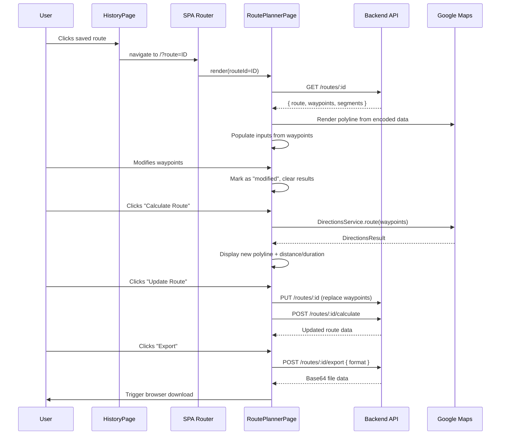
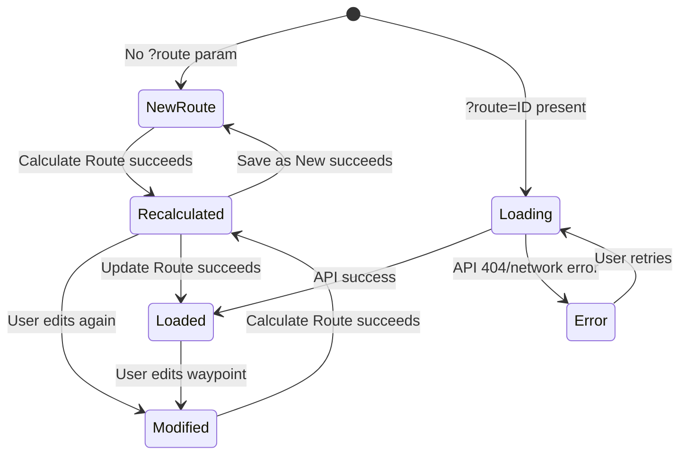

# Design Document: Route Save & Reload

## Overview

This feature enables full round-trip route management: users can load a previously saved route back into the Route Planner, modify waypoints, recalculate, update or save as new, and export directly from either the Route Planner or the History page.

The design leverages the existing backend API (`GET /routes/:id`, `PUT /routes/:id`, `POST /routes/:id/calculate`, `POST /routes/:id/export`) and extends the frontend `RoutePlannerPage` with route-loading state management, URL-based route identification (`?route=ID`), and conditional UI for update/export actions.

No new database tables or backend endpoints are required. The existing `routes`, `waypoints`, and `route_segments` tables already store all necessary data. The primary work is frontend state management and UI flow.

## Architecture



### Key Design Decisions

1. **URL-driven route loading**: The route ID is stored in the URL query parameter (`?route=ID`). This allows page refresh to retain context and enables direct linking to a saved route.

2. **Client-side route calculation**: Route calculation continues to use the Google Maps DirectionsService on the client side (existing pattern). The backend `/calculate` endpoint is called afterward to persist segments and totals.

3. **Full waypoint replacement on update**: When updating a saved route, the frontend sends the complete new waypoint list rather than incremental add/remove operations. This simplifies the update flow and avoids ordering issues.

4. **No new backend endpoints**: A new `PUT /routes/:id/waypoints` convenience endpoint will accept a full waypoint array replacement. This is simpler than orchestrating multiple add/remove/reorder calls. Alternatively, the existing `PUT /routes/:id` can be extended with an `action: 'replace_waypoints'` body.

## Components and Interfaces

### Frontend Components

#### RouteLoaderState (new interface)

Manages the loaded route state within `RoutePlannerPage`:

```typescript
interface RouteLoaderState {
  /** The loaded route ID, or null if creating a new route */
  loadedRouteId: string | null;
  /** Whether the route is currently being fetched from the backend */
  isLoading: boolean;
  /** Whether waypoints have been modified since last calculation */
  isModified: boolean;
  /** Whether the route has been recalculated after modification */
  isRecalculated: boolean;
  /** Error message from loading or updating */
  error: string | null;
  /** The original waypoints as loaded (for dirty detection) */
  originalWaypoints: WaypointData[] | null;
}

interface WaypointData {
  label: string;
  latitude: number;
  longitude: number;
  waypoint_type: 'origin' | 'stop' | 'destination';
}
```

#### RoutePlannerPage (modified)

Extended with:
- `loadRoute(routeId: string): Promise<void>` — Fetches route from API, populates inputs and map
- `handleWaypointChange(): void` — Marks state as modified, clears distance/duration
- `updateRoute(): Promise<void>` — Sends updated waypoints via PUT, then recalculates on backend
- `saveAsNew(): Promise<void>` — Creates a new route via POST with current waypoints
- `exportRoute(format: string): Promise<void>` — Calls export API and triggers download
- `renderActionButtons(): string` — Conditionally renders Update/Save as New/Export buttons based on state

#### ExportModal (new component)

A reusable modal/dropdown for format selection:

```typescript
interface ExportModalProps {
  routeId: string;
  onExport: (format: string) => Promise<void>;
  onClose: () => void;
}
```

Displays the 8 supported formats (GPX, ITN, ASC, OV2, BCR, TRK, MPS, FIT) and triggers download on selection.

#### HistoryPage (modified)

Extended with an export button per route item that opens the ExportModal inline without navigating away.

### Backend Changes

#### New action on PUT /routes/:id

Add `action: 'replace_waypoints'` to the existing PUT endpoint:

```typescript
// Body: { action: 'replace_waypoints', waypoints: WaypointInput[] }
// Deletes all existing waypoints for the route and inserts the new set.
// Resets route status to 'draft' and clears segments.
```

This keeps the API surface minimal while supporting the full-replacement pattern needed for route updates.

### SPA Router Integration

The `main.ts` router already passes `window.location.search` implicitly. The `RoutePlannerPage` will read `?route=ID` from `window.location.search` on construction and trigger loading if present.

```typescript
// In RoutePlannerPage.render():
const params = new URLSearchParams(window.location.search);
const routeId = params.get('route');
if (routeId) {
  this.loadRoute(routeId);
}
```

## Data Models

### Existing Models (no changes)

| Model | Table | Key Fields |
|-------|-------|------------|
| Route | `routes` | id, user_id, name, total_distance_km, total_duration_seconds, polyline_encoded, status |
| Waypoint | `waypoints` | id, route_id, position, label, latitude, longitude, waypoint_type |
| RouteSegment | `route_segments` | id, route_id, segment_index, distance_km, duration_seconds, country_code, polyline_encoded |

### API Response Shape (GET /routes/:id)

```typescript
interface RouteDetailResponse {
  route: {
    id: string;
    user_id: string;
    name: string;
    total_distance_km: number | null;
    total_duration_seconds: number | null;
    polyline_encoded: string | null;
    status: 'draft' | 'calculated' | 'finalized';
    created_at: string;
    updated_at: string;
  };
  waypoints: Array<{
    id: string;
    position: number;
    label: string | null;
    latitude: number;
    longitude: number;
    waypoint_type: 'origin' | 'stop' | 'destination';
  }>;
  segments: Array<{
    segment_index: number;
    distance_km: number;
    duration_seconds: number;
    country_code: string;
    polyline_encoded: string | null;
  }>;
}
```

### Frontend State Flow



### Export Download Flow

```typescript
async function downloadExport(routeId: string, format: string): Promise<void> {
  const response = await apiClient.post<ExportResponse>(`/routes/${routeId}/export`, { format });
  const { files, split, splitCount } = response.data;
  
  for (let i = 0; i < files.length; i++) {
    const blob = base64ToBlob(files[i], getMimeType(format));
    const filename = split 
      ? `route_part${i + 1}of${splitCount}.${format}`
      : `route.${format}`;
    triggerDownload(blob, filename);
  }
}
```

## Correctness Properties

*A property is a characteristic or behavior that should hold true across all valid executions of a system — essentially, a formal statement about what the system should do. Properties serve as the bridge between human-readable specifications and machine-verifiable correctness guarantees.*

### Property 1: Waypoint population preserves labels and order

*For any* valid route response containing N waypoints (1 origin, 0–10 stops, 1 destination) ordered by position, the waypoint-to-input mapping function SHALL produce exactly N input entries where the first has the origin label, the last has the destination label, and intermediate entries match the stop waypoints in position order.

**Validates: Requirements 1.1, 1.4**

### Property 2: Duration and distance formatting

*For any* positive number of seconds (duration) and positive number of kilometers (distance), the formatting functions SHALL produce a non-empty string matching the expected patterns: duration as "Xh Ymin" or "Y min", and distance as "X.X km".

**Validates: Requirements 1.3, 3.3**

### Property 3: Modification clears results and enables recalculation

*For any* RouteLoaderState where a route is loaded and has distance/duration displayed, applying a waypoint modification SHALL result in isModified being true, the Calculate Route button being enabled, and the distance/duration values being cleared.

**Validates: Requirements 2.4, 2.5**

### Property 4: Action button visibility rules

*For any* RouteLoaderState, the "Update Route" and "Save as New" buttons SHALL be visible if and only if loadedRouteId is non-null AND isRecalculated is true. In all other state combinations, these buttons SHALL be hidden.

**Validates: Requirements 4.1, 4.5**

### Property 5: Export button visibility

*For any* RouteLoaderState, the "Export" button SHALL be visible if and only if the route is in a calculated state (either loaded with status 'calculated' or isRecalculated is true after modification).

**Validates: Requirements 5.1**

### Property 6: History page export action per route

*For any* non-empty list of saved routes rendered on the History page, the rendered output SHALL contain exactly one export action element for each route in the list, and the count of export actions SHALL equal the count of routes.

**Validates: Requirements 6.1**

### Property 7: URL retains loaded route identifier

*For any* route ID that is successfully loaded into the Route Planner, the browser URL SHALL contain the query parameter `route=<ID>` where `<ID>` matches the loaded route's identifier exactly.

**Validates: Requirements 7.4**

## Error Handling

| Scenario | Handling | User Feedback |
|----------|----------|---------------|
| Route not found (404) | Clear loading state, show error | "Route not found. It may have been deleted." with link to History |
| Network error on load | Clear loading state, show error + retry | "Failed to load route. Check your connection." with Retry button |
| Route calculation fails | Retain inputs, clear map polyline | "Route calculation failed: {reason}" (from Google Maps status) |
| Update route fails (PUT) | Retain current UI state | "Failed to save changes. Please try again." |
| Export fails | Close export modal, show error | "Export failed: {reason}" |
| Unauthorized (401) | Redirect to login (handled by apiClient) | Session expired message |
| Forbidden (403) | Show error, don't load route | "You don't have access to this route." |

### Error Recovery Patterns

- **Retry on network errors**: The loading error state includes a retry button that re-triggers `loadRoute(routeId)`.
- **Graceful degradation**: If the polyline cannot be rendered (e.g., Google Maps unavailable), waypoint inputs are still populated and the user can still modify/recalculate.
- **Optimistic UI for save**: The "Update Route" button shows a spinner during the request. On failure, the button returns to its original state — no data is lost.

## Testing Strategy

### Unit Tests (Example-based)

- Route loading: mock API responses (success, 404, network error) and verify UI state transitions
- Waypoint modification: verify state changes when inputs are edited
- Export download: mock API, verify blob creation and download trigger
- Error display: verify correct error messages for each failure scenario
- Button states: verify disabled/enabled states during loading and calculating

### Property-Based Tests

Property-based testing is appropriate for this feature because several core functions are pure transformations with clear input/output behavior:

- **Waypoint mapping** (Property 1): Pure function mapping API response waypoints to UI input data
- **Formatting functions** (Property 2): Pure functions converting numbers to display strings
- **State transitions** (Property 3): Deterministic state machine transitions
- **Button visibility logic** (Properties 4, 5): Pure boolean functions of state
- **List rendering** (Property 6): Deterministic mapping from data to DOM structure count
- **URL management** (Property 7): Pure function mapping route ID to URL string

**Library**: fast-check (already available in the project's test ecosystem via vitest)

**Configuration**:
- Minimum 100 iterations per property test
- Each test tagged with: `Feature: route-save-reload, Property {N}: {title}`

### Integration Tests

- Full flow: History page click → Route Planner load → modify → recalculate → update
- Export flow: Load route → export → verify download
- URL persistence: Load route → refresh page → verify route reloads
- Backend round-trip: Create route → load → modify → update → verify data integrity

