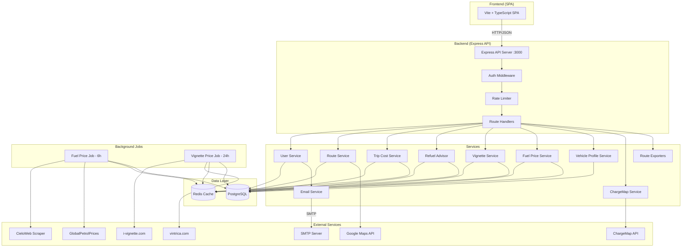
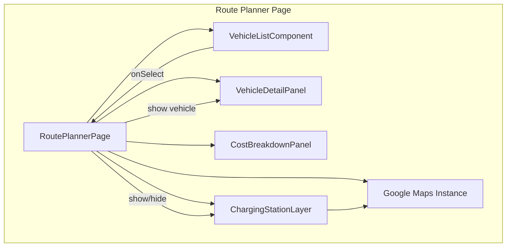

# Application Architecture Diagram

## Communication Protocols

| Connection | Protocol | Port |
|-----------|----------|------|
| Frontend → API | HTTP/JSON | 3000 |
| API → PostgreSQL | TCP (pg) | 5432 |
| API → Redis | TCP (redis) | 6379 |
| API → Google Maps | HTTPS | 443 |
| API → ChargeMap | HTTPS | 443 |
| Email Service → SMTP | SMTP/TLS | 587/465 |
| Scrapers → External Sites | HTTPS | 443 |

## Frontend Components

The `VehicleListComponent` replaces the previous dropdown-based `VehicleSelector` with a card-based grid. When an EV vehicle is selected and a route is displayed, the `ChargingStationLayer` fetches and displays charging stations on the map. The `CostBreakdownPanel` shows energy consumption (kWh) for EV vehicles instead of fuel costs.
