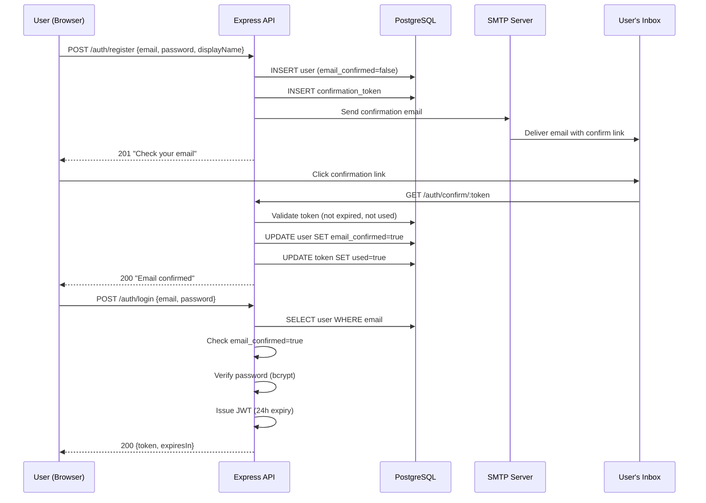
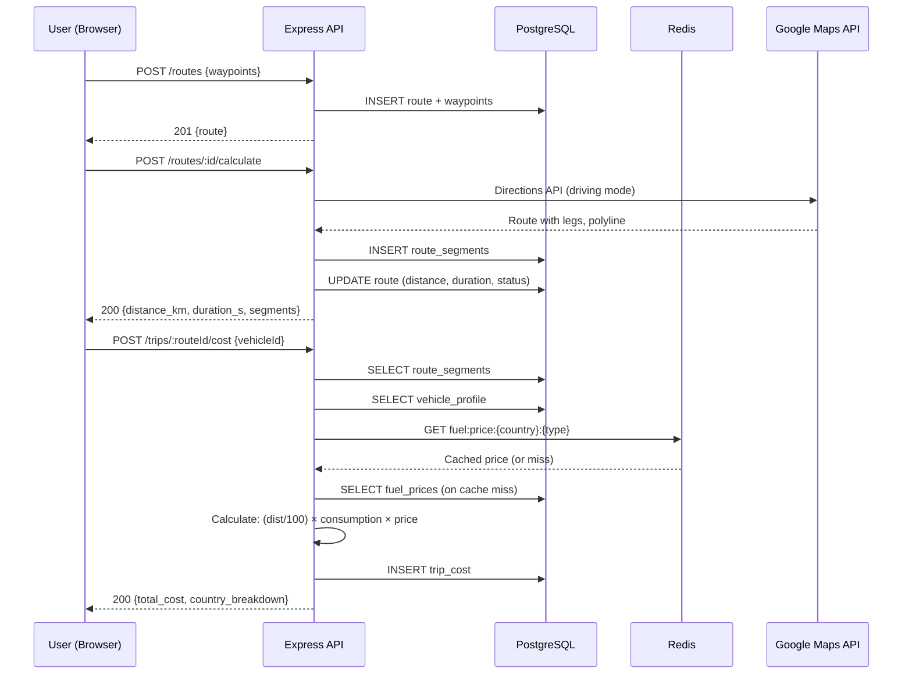
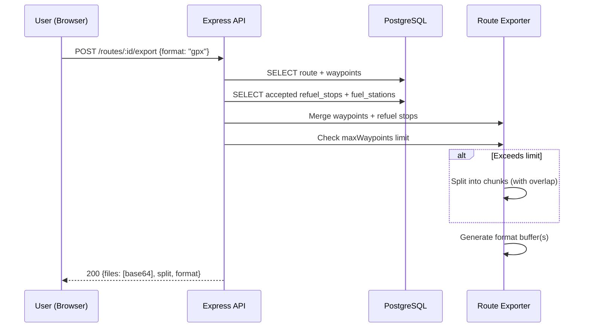
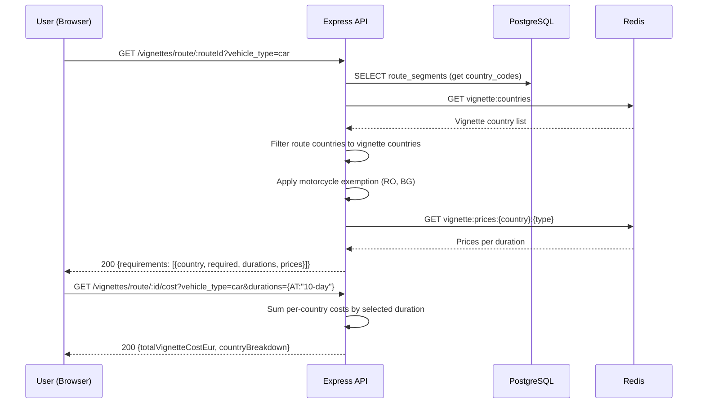

# Data Flow Diagram

## Registration → Email Confirmation → Login

```mermaid
sequenceDiagram
    participant U as User (Browser)
    participant API as Express API
    participant DB as PostgreSQL
    participant SMTP as SMTP Server
    participant Email as User's Inbox

    U->>API: POST /auth/register {email, password, displayName}
    API->>DB: INSERT user (email_confirmed=false)
    API->>DB: INSERT confirmation_token
    API->>SMTP: Send confirmation email
    SMTP->>Email: Deliver email with confirm link
    API-->>U: 201 "Check your email"

    U->>Email: Click confirmation link
    Email->>API: GET /auth/confirm/:token
    API->>DB: Validate token (not expired, not used)
    API->>DB: UPDATE user SET email_confirmed=true
    API->>DB: UPDATE token SET used=true
    API-->>U: 200 "Email confirmed"

    U->>API: POST /auth/login {email, password}
    API->>DB: SELECT user WHERE email
    API->>API: Check email_confirmed=true
    API->>API: Verify password (bcrypt)
    API->>API: Issue JWT (24h expiry)
    API-->>U: 200 {token, expiresIn}
```

## Route Planning → Trip Cost Calculation

```mermaid
sequenceDiagram
    participant U as User (Browser)
    participant API as Express API
    participant DB as PostgreSQL
    participant Cache as Redis
    participant GM as Google Maps API

    U->>API: POST /routes {waypoints}
    API->>DB: INSERT route + waypoints
    API-->>U: 201 {route}

    U->>API: POST /routes/:id/calculate
    API->>GM: Directions API (driving mode)
    GM-->>API: Route with legs, polyline
    API->>DB: INSERT route_segments
    API->>DB: UPDATE route (distance, duration, status)
    API-->>U: 200 {distance_km, duration_s, segments}

    U->>API: POST /trips/:routeId/cost {vehicleId}
    API->>DB: SELECT route_segments
    API->>DB: SELECT vehicle_profile
    API->>Cache: GET fuel:price:{country}:{type}
    Cache-->>API: Cached price (or miss)
    API->>DB: SELECT fuel_prices (on cache miss)
    API->>API: Calculate: (dist/100) × consumption × price
    API->>DB: INSERT trip_cost
    API-->>U: 200 {total_cost, country_breakdown}
```

## Route Export

```mermaid
sequenceDiagram
    participant U as User (Browser)
    participant API as Express API
    participant DB as PostgreSQL
    participant EXP as Route Exporter

    U->>API: POST /routes/:id/export {format: "gpx"}
    API->>DB: SELECT route + waypoints
    API->>DB: SELECT accepted refuel_stops + fuel_stations
    API->>EXP: Merge waypoints + refuel stops
    API->>EXP: Check maxWaypoints limit
    alt Exceeds limit
        EXP->>EXP: Split into chunks (with overlap)
    end
    EXP->>EXP: Generate format buffer(s)
    API-->>U: 200 {files: [base64], split, format}
```

## Vignette Cost Tracking

```mermaid
sequenceDiagram
    participant U as User (Browser)
    participant API as Express API
    participant DB as PostgreSQL
    participant Cache as Redis

    U->>API: GET /vignettes/route/:routeId?vehicle_type=car
    API->>DB: SELECT route_segments (get country_codes)
    API->>Cache: GET vignette:countries
    Cache-->>API: Vignette country list
    API->>API: Filter route countries to vignette countries
    API->>API: Apply motorcycle exemption (RO, BG)
    API->>Cache: GET vignette:prices:{country}:{type}
    Cache-->>API: Prices per duration
    API-->>U: 200 {requirements: [{country, required, durations, prices}]}

    U->>API: GET /vignettes/route/:id/cost?vehicle_type=car&durations={AT:"10-day"}
    API->>API: Sum per-country costs by selected duration
    API-->>U: 200 {totalVignetteCostEur, countryBreakdown}
```
