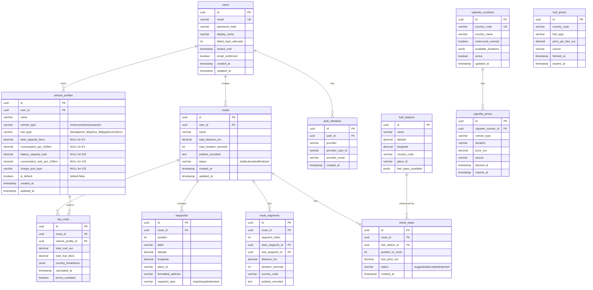

# Database Schema

## Entity Relationship Diagram

## Vehicle Profiles Table (Detailed)

The `vehicle_profiles` table uses a single-table design with nullable columns to support both ICE and EV vehicles.

### Columns

| Column | Type | Nullable | Default | Description |
|--------|------|----------|---------|-------------|
| id | UUID | NO | gen_random_uuid() | Primary key |
| user_id | UUID | NO | — | FK → users.id |
| name | VARCHAR(100) | NO | — | Display name (brand + model) |
| vehicle_type | VARCHAR(20) | NO | — | motorcycle, car, camper, **ev** |
| fuel_type | VARCHAR(20) | YES | — | diesel, petrol_95, petrol_98, lpg, **electric**, NULL |
| tank_capacity_liters | DECIMAL(5,1) | YES | — | 5–200 L (NULL for EV) |
| consumption_per_100km | DECIMAL(4,1) | YES | — | 1–50 L/100km (NULL for EV) |
| battery_capacity_kwh | DECIMAL(5,1) | YES | — | 10–200 kWh (NULL for ICE) |
| consumption_kwh_per_100km | DECIMAL(4,1) | YES | — | 5–50 kWh/100km (NULL for ICE) |
| charge_port_type | VARCHAR(20) | YES | — | Type1, Type2, CCS, CHAdeMO, Tesla (NULL for ICE) |
| is_default | BOOLEAN | NO | false | Only one per user can be true |
| created_at | TIMESTAMP | NO | NOW() | Creation timestamp |
| updated_at | TIMESTAMP | NO | NOW() | Last update timestamp |

### Constraints

| Constraint | Type | Definition |
|-----------|------|------------|
| vehicle_profiles_vehicle_type_check | CHECK | `vehicle_type IN ('motorcycle', 'car', 'camper', 'ev')` |
| vehicle_profiles_fuel_type_check | CHECK | `fuel_type IN ('diesel', 'petrol_95', 'petrol_98', 'lpg', 'electric') OR fuel_type IS NULL` |
| vehicle_profiles_tank_capacity_check | CHECK | `tank_capacity_liters IS NULL OR tank_capacity_liters BETWEEN 5 AND 200` |
| vehicle_profiles_consumption_check | CHECK | `consumption_per_100km IS NULL OR consumption_per_100km BETWEEN 1 AND 50` |
| vehicle_profiles_battery_capacity_check | CHECK | `battery_capacity_kwh IS NULL OR battery_capacity_kwh BETWEEN 10 AND 200` |
| vehicle_profiles_consumption_kwh_check | CHECK | `consumption_kwh_per_100km IS NULL OR consumption_kwh_per_100km BETWEEN 5 AND 50` |
| vehicle_profiles_charge_port_check | CHECK | `charge_port_type IS NULL OR charge_port_type IN ('Type1', 'Type2', 'CCS', 'CHAdeMO', 'Tesla')` |

### Indexes

| Index | Columns | Type |
|-------|---------|------|
| idx_vehicle_profiles_user | user_id | B-tree |
| idx_vehicle_profiles_user_default | (user_id, is_default) WHERE is_default = true | Partial |

### Conditional Field Requirements

| vehicle_type | Required fields | Optional/NULL fields |
|-------------|----------------|---------------------|
| motorcycle, car, camper | fuel_type, tank_capacity_liters, consumption_per_100km | battery_capacity_kwh, consumption_kwh_per_100km, charge_port_type |
| ev | battery_capacity_kwh, consumption_kwh_per_100km, charge_port_type | fuel_type (defaults to 'electric'), tank_capacity_liters, consumption_per_100km |

## Migrations

| Migration | Description |
|-----------|-------------|
| 1700000000000_initial-schema.js | Creates all tables (users, vehicle_profiles, routes, waypoints, segments, fuel, trips, vignettes) |
| 1700000001000_seed-vignette-countries.js | Seeds vignette country data |
| 1700000002000_add-email-confirmation.js | Adds email confirmation fields and tokens table |
| 1700000003000_add-last-failed-at.js | Adds last_failed_at to users |
| **1700000004000_add-ev-vehicle-type.js** | Adds EV support: battery/consumption/charge_port columns, is_default, nullable ICE columns, updated constraints |
